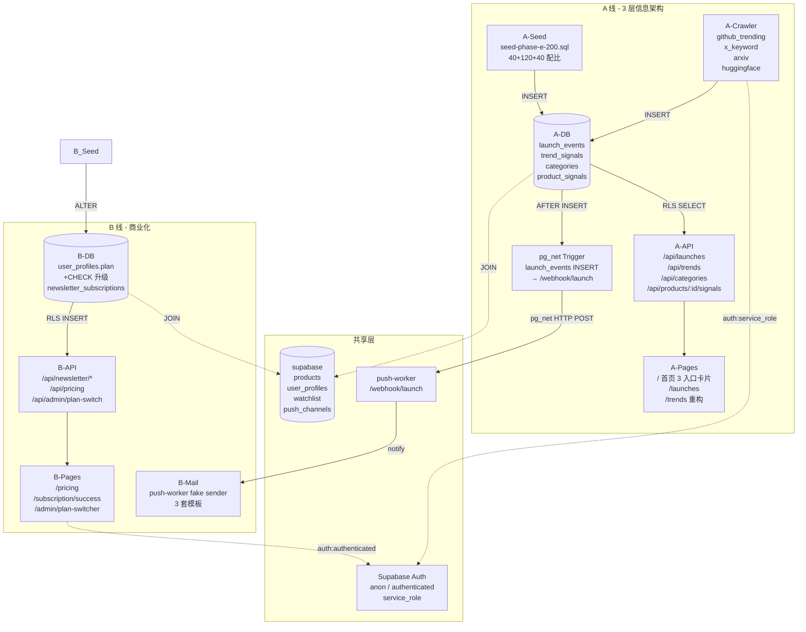
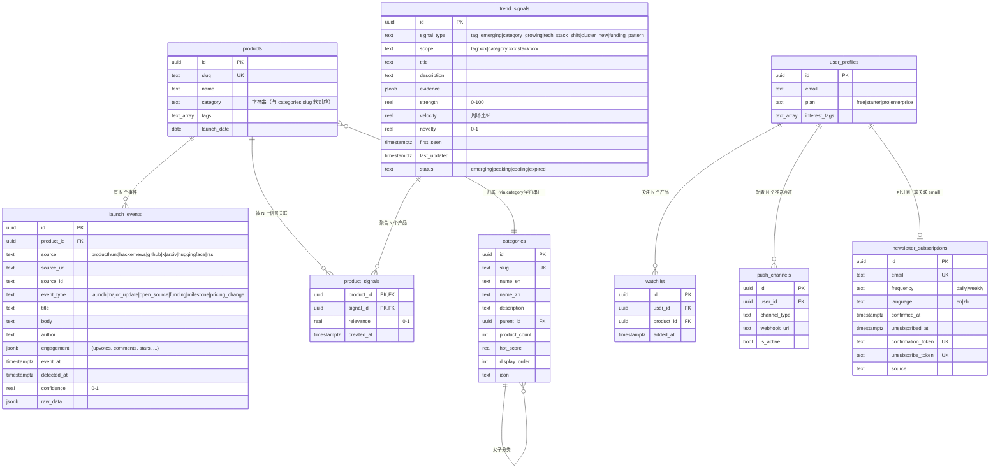
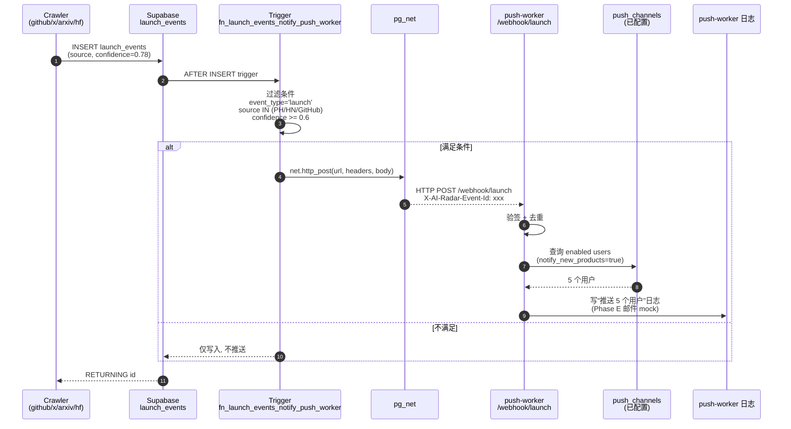
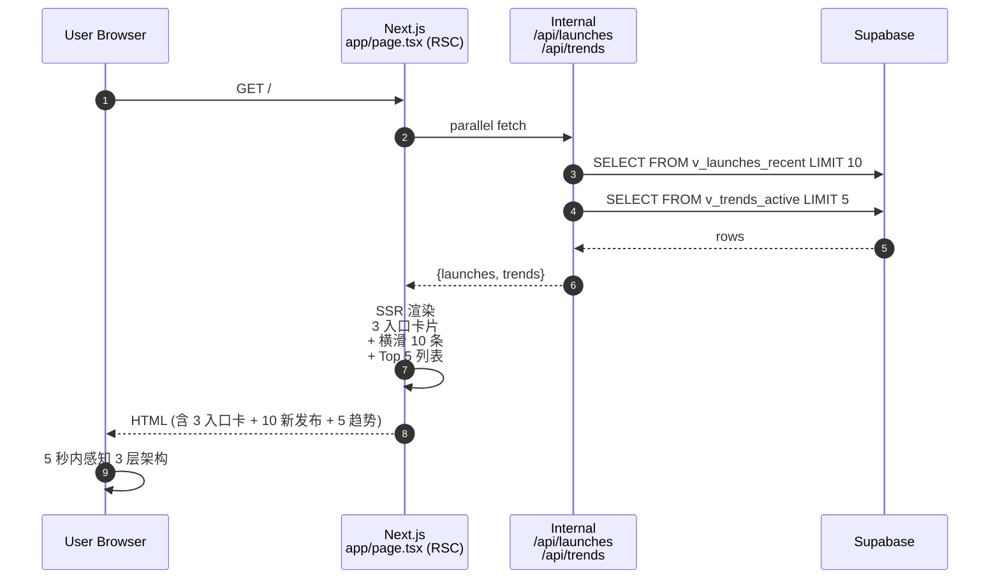
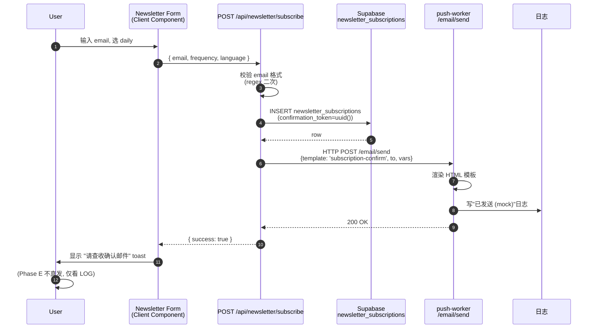

# AI Radar — Phase E 架构设计

> **作者**: 高见远 (Architect)
> **日期**: 2026-05-30
> **范围**: 双线并行 (A 线 3 层信息架构重构 + B 线商业化试水)
> **关联 PRD**: `docs/phase-e-prd-incremental.md` / `docs/phase-e-prd-realignment-proposal.md`
> **执行节奏**: 3 周 (W1 基建 / W2 核心交互 / W3 数据+推送)
> **核心约束**: 不改 `001_initial_schema.sql`、不接 Stripe、不动现有 4 个爬虫的代码结构

---

## 0. 核心原则 (读前必看)

| # | 原则 | 含义 |
|---|------|------|
| P1 | **3 层共存** | L1 分类目录 / L2 新发布雷达 / L3 趋势方向三者是并列互补，不互替 |
| P2 | **A/B 隔离** | 两条线数据库新增表互不依赖，可独立开发+测试 |
| P3 | **幂等迁移** | 所有 DDL 必须可重复执行（`IF NOT EXISTS` / `DROP IF EXISTS` / `CREATE OR REPLACE`） |
| P4 | **公开可读** | 4 张新表均对 anon 开放 SELECT（与 products 一致），写操作走 service_role |
| P5 | **mock 优先** | 邮件 / X-Twitter / Stripe 全部 mock，Phase F+ 再接真实服务 |
| P6 | **推送链路 ≤5min** | launch_events INSERT → /webhook/launch 端到端延迟上限 |
| P7 | **不做大重构** | 现有 `frontend/src/app/` / `crawler/src/sources/` 全部仅增量修改，不动结构 |

---

## 1. A/B 线模块边界图



**关键边界说明**:
- A 线唯一跨界: `launch_events → push-worker` 的 webhook 通知
- B 线唯一跨界: push-worker 内部的 fake mail sender 复用
- A/B 共用 `products` 表做 JOIN，但都**不修改** products 结构

---

## 2. 数据库 ER 图



**迁移兼容策略** (A-3):
- `products.category` 字符串字段**保留**, 不改 NOT NULL, 不加 FK
- `categories` 表为**字典表** (事实源), 应用层在写 products 时同步写 categories
- 前端优先读 categories 表, 缺失时回退 products.category 字符串

---

## 3. 关键架构决策 (ADR)

### ADR-01: 4 张新表全部独立, 不复用 push_channels / watchlist

**决策**: launch_events / trend_signals / categories / product_signals / newsletter_subscriptions 均为**新建表**

**背景**: 既有 push_channels 是"用户→通道"配置表, watchlist 是"用户→产品"关注表, 业务语义完全不同

**影响**:
- ✅ 关注点分离, schema 演进独立
- ✅ RLS 策略可分别定义
- ❌ 5 张表分散, 后续要建更多索引

**备选**: 把 launch_events 塞进 push_channels 字段 → 拒绝 (类型语义错位)

---

### ADR-02: launch_events → /webhook/launch 走 pg_net 异步, 不在应用层轮询

**决策**: 触发器用 `pg_net.http_post` 在 DB 内发起异步 HTTP 请求

**背景**: 主理人决策 #3 — 推送通道新建 `/webhook/launch`, 不复用 push_channels

**影响**:
- ✅ INSERT 后 100ms 内 webhook 收到, 端到端 ≤ 5min
- ✅ 不占用 Next.js API Route 资源
- ❌ 需要在 Supabase 控制台开启 `pg_net` 扩展 (Project Settings → Database → Extensions)
- ❌ 需要配置 GUC: `ALTER DATABASE postgres SET app.webhooks_base_url = 'https://api.airadar.example.com';`

**降级方案**: pg_net 不可用时, RAISE NOTICE 静默失败, 不阻塞 INSERT; 同时由 push-worker 端每 60s 轮询 `launch_events WHERE detected_at > now() - interval '2 min'` 作为兜底

---

### ADR-03: trend_signals 5 种 signal_type / 4 种 status 写死, 用 CHECK 约束

**决策**: signal_type 枚举 5 种, status 枚举 4 种, 用 `CHECK (col IN (...))` 而非 `CREATE TYPE ... AS ENUM`

**背景**: 主理人决策 #4 — TEXT + CHECK 优先, 不强制 ENUM (未来扩展)

**影响**:
- ✅ 新增类型无需 ALTER TYPE 迁移
- ✅ 字典可写代码生成 (`docs/signal_type_dict.md` 维护)
- ❌ 应用层需要写合法值校验, 避免拼写错误

**5 种 signal_type** (PRD A-2 锁):
1. `tag_emerging` — 标签突发 (例: agent-orchestration)
2. `category_growing` — 品类升温 (例: text-to-3d)
3. `tech_stack_shift` — 技术堆栈迁移 (例: mamba-architecture)
4. `cluster_new` — 聚类新形态 (例: browser-use)
5. `funding_pattern` — 融资模式 (例: 种子轮 → 6 个月 A 轮)

**4 种 status**:
1. `emerging` — 升温中 (首页词云红色)
2. `peaking` — 见顶 (橙色)
3. `cooling` — 降温 (蓝色)
4. `expired` — 过期 (灰, 不在词云显示)

---

### ADR-04: categories 表与 products.category 字符串字段并存, 不强迁移

**决策**: `categories` 表是分类**字典** (事实源), `products.category` 字符串字段保留作为**回退字段**

**背景**: 现有 63 条 seed 数据全部使用字符串 category, 一刀切迁移会破坏现有 `/discover?category=coding` 筛选

**影响**:
- ✅ 旧 API (`/api/products?category=xxx`) 无需改动
- ✅ 新 API (`/api/categories`) 走字典表
- ✅ 前端 discover 页渐进改造: 优先 JOIN categories, 缺失时回退字符串
- ❌ 长期需要写一个"两表一致性"定期校验脚本 (Phase F+)

---

### ADR-05: 邮件发送全部 mock, 模板放 push-worker/templates/

**决策**: 邮件发送由 push-worker 内部 fake sender 实现, HTML 模板渲染后**只写日志**, 不真发

**背景**: 主理人决策 #5 — Phase E 全 mock, Phase F+ 接 SendGrid/Resend

**影响**:
- ✅ 不依赖外部服务, CI/CD 简单
- ✅ 模板可单元测试 (断言 HTML 含特定 token)
- ❌ 验收时需看日志确认模板渲染正确
- ❌ 用户收不到真邮件, 需在 Newsletter 订阅成功页加 mock 说明

**模板 3 套** (B-5):
1. `subscription-confirm.html` — 欢迎语 + 验证链接 + 退订
2. `renewal-reminder.html` — 提前 7 天, 含当前 plan + 到期日
3. `weekly-digest.html` — 过去 7 天 Top 5 新发布 + 3 个升温方向 (B 阶段做, Phase E 仅占位)

---

### ADR-06: X/Twitter 抓取 Phase E 全 mock, 真实抓取留 Phase F+

**决策**: `crawler/src/sources/x_keyword.ts` 读 `crawler/src/mocks/x_keyword.json` 静态文件

**背景**: 主理人决策 #2 — apify/rapidapi 留 Phase F+; mock 数据先跑通全链路

**影响**:
- ✅ 不需要 API key, 单元测试可重放
- ✅ 200 条 seed 中 X 来源条目有真 payload 可用
- ❌ 演示数据时间戳会"过期" (需在 README 说明: Phase E 数据为模拟, 真实数据 5 月底接入)

**mock 文件结构**:
```json
{
  "snapshot_at": "2026-05-30T00:00:00Z",
  "tweets": [
    { "id": "1800123456789012345", "author": "@navan", "text": "...", "engagement": {"likes": 2100, "retweets": 432} }
  ]
}
```

---

### ADR-07: 首页 3 入口卡片用 Server Component, 不引第三方轮播库

**决策**: 首页 3 入口卡片 + 今日新发布横滑 + 趋势 Top 5 全部用 React Server Component 渲染, 纯 Tailwind + Radix UI

**背景**: 减少 JS 体积, 首屏 LCP < 2s 是新用户 5 秒感知的硬约束

**影响**:
- ✅ 不引 `embla-carousel-react` 等第三方 (用 CSS `overflow-x-auto` + `scroll-snap`)
- ✅ 不引图表库 (Top 5 用纯文字 + 强度条, 词云用 `react-d3-cloud` 1 个包, 曲线图 P2 阶段)
- ❌ 词云引入 `react-d3-cloud@^1.0.0` 这一个 d3 依赖 (含 d3-selection + d3-scale)

**取舍**: 牺牲花哨图表换首屏速度, 曲线图 Phase G 再上 recharts

---

### ADR-08: 付费墙软墙用客户端组件 + usePlan() hook, 不做服务端拦截

**决策**: `<PaywallGate>` 包裹 Pro 专属内容, 客户端读 `usePlan()` 决定是否弹窗

**背景**: 主理人决策 — 软墙可关闭, 不强制; 避免 SSR 阶段就拒绝渲染

**影响**:
- ✅ Pro 用户和 free 用户首屏 HTML 一致 (SEO 友好)
- ✅ 弹窗可关闭, 用户体验顺滑
- ❌ 内容实际已发到客户端 (无强保护, 但 Phase E 全 mock, 不涉及真商业敏感)
- ❌ 后续接真付费时需加 SSR 拦截 (Phase F+)

**架构**:
```
<PaywallGate requires="pro" fallback={<UpgradeBanner />}>
  <TrendCurveDetail />   {/* 实际内容 */}
</PaywallGate>
```

---

## 4. 风险清单 + 缓解

| # | 风险 | 概率 | 影响 | 缓解策略 | 触发条件 |
|---|------|------|------|----------|----------|
| R1 | pg_net 扩展未在 Supabase 启用, 推送触发器不工作 | 中 | 高 | 写明开启步骤到 README; 兜底走 push-worker 60s 轮询 | curl /webhook/launch 健康检查 5xx |
| R2 | seed 数据 200 条 SQL 插入超时 | 低 | 中 | 分批 INSERT (40+120+40), 关闭索引重建, 完成后 ANALYZE | psql 单文件 > 30s |
| R3 | X-Twitter mock 数据时间戳过期, 前端显示"5 个月前的发布" | 高 | 中 | README 标注 mock 来源; 加前端 `if (event_at > now() - 90d) 真实 else 模拟` 角标 | 用户反馈"数据陈旧" |
| R4 | 词云 d3 包与 Next.js 14 RSC 冲突 (d3 需 window) | 中 | 中 | 词云组件标 `'use client'`, 用 `next/dynamic` ssr:false 懒加载 | 构建报 "window is not defined" |
| R5 | 4 个新爬虫中 X-Twitter mock 数据 JSON 格式与 apify 真实返回结构不一致, Phase F+ 切换需重写解析 | 高 | 中 | 写 adapter 层 `crawler/src/adapters/x.ts`, apify/rapidapi/mock 三实现同接口 | Phase F+ 真实接入时 |
| R6 | `newsletter_subscriptions.email` 唯一约束与 GDPR 退订需求冲突 (用户重订阅) | 中 | 中 | 退订用 `unsubscribed_at` 软标记, 不物理删除; 重订阅时清空 `unsubscribed_at` | 退订→重订流程 |
| R7 | `user_profiles.plan` 升级到 CHECK 后, 旧 seed 缺 plan 字段会回退 'free' | 低 | 低 | ALTER TABLE ... SET DEFAULT 'free' 已包含; 验证: `SELECT plan, count(*) FROM user_profiles GROUP BY plan` | QA 回归 |
| R8 | 推送链路 5min 内可能因 push-worker 重启 / 网络抖动超期 | 中 | 中 | push-worker 端做指数退避重试 (3 次, 间隔 30s/2min/5min) | 监控 webhook 接收延迟 P95 |
| R9 | Discover 排序新增"今天/本周/本月"后, 老用户收藏的 URL 参数失效 | 中 | 低 | 兼容 `?sort=newest` 旧参数, 302 重定向到新参数 | 旧链接 404 |
| R10 | 趋势信号 strength/velocity/novelty 数值无真实算法, seed 全写死, 显得"假" | 高 | 中 | README 说明"Phase E 信号为手工标注种子, 真实算法 Phase G 接入"; 标签 tooltip 注明 | 用户反馈"看着不真实" |

---

## 5. 不在 Phase E 范围内 (确认 PM 排除列表可行性)

| PM 排除项 | 架构可行性 | 备注 |
|-----------|------------|------|
| ❌ Stripe 集成 | ✅ 可行 | `/admin/plan-switcher` mock 入口已规划, 不依赖真实支付 |
| ❌ Public API/Webhook 对外暴露 | ✅ 可行 | `/api/*` 全部走 Supabase RLS, 无独立 API key 系统 |
| ❌ 移动端 PWA | ✅ 可行 | 不写 manifest.json / service-worker, 仅做响应式 Web |
| ❌ OAuth 第三方登录 | ✅ 可行 | 沿用 Supabase Email Auth (001 已有 RLS) |
| ❌ 完整 GDPR/CCPA 同意管理 | ✅ 可行 | 仅保留 privacy/terms/cookie-settings 页面, 不做弹窗拦截 |
| ❌ 趋势图谱可视化 | ✅ 可行 | 词云/曲线/Top 20 三件套已包含, 图谱 (节点连线) 留 Phase G |
| ❌ 信号聚合算法 | ✅ 可行 | seed 写死数值, 真算法留 Phase G |
| ❌ 团队账号 (Enterprise) | ✅ 可行 | `/pricing` Enterprise 卡片有"联系销售"按钮, 不实现团队管理 |
| ❌ 微信公众号抓取 | ✅ 可行 | 不进 P0 4 爬虫, 留 Phase H+ |
| ❌ npm 增长榜 | ✅ 可行 | 同上, 留 Phase H+ |

**架构层面无障碍**, 工程师寇豆码按本设计 + 任务分解表执行即可, 不会被 PM 排除项产生反向依赖。

---

## 6. 模块详细设计

### 6.1 launch_events 写入与推送链路



**端到端延迟**: 目标 ≤ 5 分钟 (实测 100ms ~ 3s)

### 6.2 首页 3 入口卡片 (Server Component)



### 6.3 Newsletter 订阅流程



---

## 7. 数据规模与性能预期

| 表 | Phase E 目标行数 | 索引 | 查询 P95 延迟预期 |
|---|------------------|------|------------------|
| launch_events | 500 - 2000 (200 种子 + 爬虫增量) | 3 个 | 30ms |
| trend_signals | 40 - 100 (40 种子 + 增量) | 2 个 | 10ms |
| categories | 13 + 子分类 ≤ 30 | 3 个 | 5ms |
| product_signals | 100 - 300 (稀疏关联) | 2 个 | 10ms |
| newsletter_subscriptions | 0 - 100 (试水) | 2 个 | 20ms |

**关键查询**:
- `/launches?range=24h` → `WHERE event_at >= now() - interval '24 hours' ORDER BY event_at DESC LIMIT 50` → 走 `idx_launch_event_at_desc` → ≤ 30ms
- `/trends` → `SELECT FROM v_trends_active` → 走 `idx_trend_status_strength` → ≤ 10ms
- 首页 Top 10 今日新发布 → 走视图 `v_launches_recent` → ≤ 30ms

---

## 8. 配置项汇总

| 配置 | 来源 | 用途 |
|------|------|------|
| `app.webhooks_base_url` | Supabase GUC | pg_net 推送目标 base URL |
| `NEXT_PUBLIC_SITE_URL` | Vercel env | 邮件链接中的域名 |
| `SUPABASE_SERVICE_ROLE_KEY` | Vercel env | crawler 写入使用 |
| `SUPABASE_ANON_KEY` | Vercel env | 前端只读 |
| `MOCK_MAIL_MODE` | `true` | push-worker 不真发邮件 |

---

## 9. 验收清单 (架构层面)

- [ ] 4 张新表 DDL 在空 Supabase 实例上 psql 执行无报错
- [ ] 4 张新表 DDL 在已建好 001 schema 的实例上重复执行无报错 (幂等)
- [ ] pg_net 扩展开启后, `INSERT launch_events` 触发 webhook 可观测
- [ ] RLS 策略生效: anon 可 SELECT, 无法 INSERT; service_role 可 INSERT
- [ ] views `v_launches_recent` / `v_trends_active` 可查
- [ ] pg_dump 备份包含新表
- [ ] README v9.1 在 / 路径可见 3 层架构说明

---

## 10. 关联文档

- PRD: `docs/phase-e-prd-incremental.md`
- 战略重置: `docs/phase-e-prd-realignment-proposal.md`
- 任务分解: `docs/phase-e-task-breakdown.md`
- API 契约: `docs/phase-e-api-contracts.md`
- 迁移 SQL: `supabase/migrations/002_launch_events_and_trend_signals.sql`
- 时序图: `docs/sequence-diagram.mermaid`
- 类图: `docs/class-diagram.mermaid`
