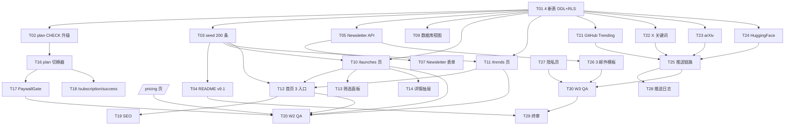

# AI Radar — Phase E 任务分解

> **作者**: 高见远 (Architect)
> **日期**: 2026-05-30
> **执行人**: 寇豆码 (Engineer)
> **关联文档**: `docs/phase-e-architecture.md` / `docs/phase-e-api-contracts.md` / `supabase/migrations/002_launch_events_and_trend_signals.sql`
> **节奏**: 3 周 (W1 基建 / W2 核心交互 / W3 数据+推送)
> **约束**: 每条任务粒度 = 1 名工程师 0.5-2 天可完成

---

## 0. 任务总览统计

| 范围 | 任务数 | 工作日预估 |
|------|--------|------------|
| A 线 (信息架构) | 20 | 11.5 人日 |
| B 线 (商业化) | 11 | 6.5 人日 |
| 共享 / 跨线 | 6 | 3.5 人日 |
| **合计** | **37** | **21.5 人日** ≈ 3 周 × 1 人 |

**复杂度分布**: S (≤ 0.5 天) × 14 / M (0.5-1.5 天) × 17 / L (1.5-3 天) × 6

---

## 1. W1 — 基建周任务 (A 线 4 + B 线 3 + 共享 2 = 9 任务)

### T01 [A线-W1] 4 张新表 DDL + 索引 + RLS (W1-D1)
- **模块**: 数据库
- **文件**:
  - `supabase/migrations/002_launch_events_and_trend_signals.sql` (新建, 已由架构师出初稿, 工程师 review + 调通)
- **依赖**: 无
- **复杂度**: M
- **优先级**: P0
- **负责人**: 寇豆码
- **验收标准**:
  1. 在 Supabase 项目 `prwqhfahtqfmosmslgon` 上 psql 执行无报错
  2. 重复执行 (执行 2 次) 无报错 (幂等)
  3. 5 张表 (launch_events / trend_signals / categories / product_signals / newsletter_subscriptions) 全部存在
  4. RLS 策略已 enable 且 anon SELECT 可用 (用 `curl + anon_key` 验证)
  5. 索引全部创建: `\di` 看到 9 个新索引
  6. 触发器 `trg_launch_events_notify_push` 存在

### T02 [A线-W1] `user_profiles.plan` 升级到 TEXT+CHECK (W1-D1)
- **模块**: 数据库
- **文件**:
  - `supabase/migrations/002_launch_events_and_trend_signals.sql` (Part 1 章节, 与 T01 合并执行)
- **依赖**: T01
- **复杂度**: S
- **优先级**: P0
- **验收标准**:
  1. `user_profiles.plan` 有 CHECK 约束, 4 个枚举值
  2. 默认值 'free' 生效
  3. 现有 63 条 seed 数据中 plan 为空的用户回退 'free'
  4. `INSERT user_profiles (plan='invalid')` 报错

### T03 [A线-W1] seed SQL 生成脚本 (200 条, 40+120+40) (W1-D2~D3)
- **模块**: 数据库
- **文件**:
  - `supabase/seed-phase-e-200.sql` (新建)
  - `supabase/seed-phase-e-products-40.sql` (新建, 40 成熟产品)
  - `supabase/seed-phase-e-launch-events-120.sql` (新建, 120 新发布事件)
  - `supabase/seed-phase-e-trend-signals-40.sql` (新建, 40 趋势信号)
- **依赖**: T01
- **复杂度**: L
- **优先级**: P0
- **验收标准**:
  1. 40 条 L1 成熟产品覆盖 13 个分类, 包含 ChatGPT/Claude/Cursor/Midjourney/Runway/Perplexity 等头部
  2. 120 条 launch_events 来自 ≥ 5 个源 (producthunt/hackernews/github/x/arxiv), 时间分布 2025-12 ~ 2026-05
  3. 40 条 trend_signals 覆盖 5 种 signal_type, status 分布 60% emerging + 30% peaking + 10% cooling
  4. 每条 L1 产品至少 1 条 launch_event 关联 (LEFT JOIN 验证)
  5. 至少 20 条 product_signals 关联记录 (产品-信号多对多)
  6. 40 条 categories 字典 (13 顶级 + 子分类)
  7. 单文件 psql 执行 ≤ 30s, 总执行 ≤ 60s
  8. ANALYZE 完成后查询 P95 < 30ms (T01 索引已建)

### T04 [A线-W1] README v9.1 重写 (W1-D3)
- **模块**: 文档
- **文件**:
  - `README.md` (重写, 不新增)
- **依赖**: T01, T03
- **复杂度**: M
- **优先级**: P0
- **验收标准**:
  1. 开篇 1 段话讲"3 层信息架构", 配 3 入口卡片 ASCII 图
  2. 数据流图: sources → launch_events/trend_signals → products → 前端
  3. 章节: 项目背景 / 信息架构 / 数据模型 / 爬虫矩阵 / 商业化 / 路线图
  4. 爬虫矩阵章节明确"4 个已实现 + 4 个 P0 扩展中", 不写 15 个
  5. 数据模型章节放 4 张新表 DDL 摘要 (5-10 行/表)
  6. 英文主版, 关键术语双语 (例: 成熟赛道 / Mature Categories)

### T05 [B线-W1] Newsletter 订阅表 + API 端点 (W1-D2)
- **模块**: API + 数据库
- **文件**:
  - `supabase/migrations/002_launch_events_and_trend_signals.sql` (Part 6, 与 T01 合并)
  - `frontend/src/app/api/newsletter/subscribe/route.ts` (新建)
  - `frontend/src/app/api/newsletter/confirm/route.ts` (新建)
- **依赖**: T01
- **复杂度**: M
- **优先级**: P0
- **验收标准**:
  1. POST /api/newsletter/subscribe 接收 email+frequency+language
  2. 写 newsletter_subscriptions 表, 生成 confirmation_token
  3. 触发 push-worker mock 邮件 (写日志)
  4. GET /api/newsletter/confirm?token=xxx 标记 confirmed_at
  5. 重复 email 返回 4006 错误码
  6. 邮箱格式校验: `xxx@yyy.zz` 通过, `xxx@yyy` 拒绝
  7. curl 测试: `curl -X POST /api/newsletter/subscribe -d '{"email":"test@example.com","frequency":"daily"}'` 返回 201

### T06 [B线-W1] `/pricing` 页面 + 3 档订阅卡片 (W1-D3~D4)
- **模块**: 前端页面
- **文件**:
  - `frontend/src/app/pricing/page.tsx` (新建, RSC)
  - `frontend/src/app/pricing/PricingCards.tsx` (新建, 客户端组件)
  - `frontend/src/app/api/pricing/route.ts` (新建)
  - `frontend/src/messages/en.json` (修改, 加 pricing 节点)
  - `frontend/src/messages/zh.json` (修改, 加 pricing 节点)
- **依赖**: 无 (Mock 数据优先, DB 不依赖)
- **复杂度**: M
- **优先级**: P0
- **验收标准**:
  1. 路由 `/pricing` 渲染 3 档卡片 (Starter $29 / Pro $79 / Enterprise $299)
  2. 月付/年付切换 (年付省 20%)
  3. Pro 卡片有"推荐"角标, 突出显示
  4. CTA 按钮: Starter/Pro → `/api/admin/plan-switch?plan=xxx` mock 弹窗; Enterprise → `mailto:`
  5. 底部 FAQ 3-5 条 (订阅周期/退款/发票/多账号/取消)
  6. i18n 完整: `/en/pricing` 和 `/zh/pricing` 切换正常
  7. 响应式: 桌面 3 列 / 平板 2 列 / 手机 1 列
  8. Lighthouse 性能 ≥ 90, SEO ≥ 95

### T07 [B线-W1] Newsletter 订阅表单组件 (W1-D4)
- **模块**: 前端组件
- **文件**:
  - `frontend/src/components/NewsletterForm.tsx` (新建, 客户端)
  - `frontend/src/app/api/newsletter/subscribe/route.ts` (与 T05 共享)
- **依赖**: T05
- **复杂度**: S
- **优先级**: P0
- **验收标准**:
  1. 组件接受 props: `source: string` (追踪来源), `defaultFrequency?: 'daily'|'weekly'`
  2. 邮箱输入框 + 频率下拉 (默认 daily) + 提交按钮
  3. 提交后: loading 状态 / 成功 toast / 失败原因
  4. 3 个使用位点: 首页 Hero 下方 / Pricing 页顶部 / `/launches` 空态
  5. a11y: label 关联 input, 错误信息有 `aria-describedby`
  6. 邮箱防抖校验 (blur 时验证)

### T08 [共享-W1] `.env.example` 补全 + 部署文档 (W1-D4)
- **模块**: 配置
- **文件**:
  - `frontend/.env.example` (修改, 加 SUPABASE_SERVICE_ROLE_KEY / NEXT_PUBLIC_SITE_URL)
  - `crawler/.env.example` (修改, 加 4 源 mock 数据路径)
  - `push-worker/.env.example` (新建或修改, 加 MOCK_MAIL_MODE / WEBHOOK_SECRET)
  - `docs/deploy.md` (新建, 含 pg_net 开启步骤 / GUC 设置命令)
- **依赖**: T01
- **复杂度**: S
- **优先级**: P0
- **验收标准**:
  1. 3 份 `.env.example` 完整, 含 Phase E 新增所有变量
  2. `docs/deploy.md` 含 Supabase 控制台操作截图位置 (Phase E 仅描述步骤, 截图 Phase F+)
  3. 步骤含: ① 开启 pg_net 扩展 ② 设置 `app.webhooks_base_url` GUC ③ 部署 push-worker

### T09 [A线-W1] 数据库视图 (v_launches_recent / v_trends_active) (W1-D2)
- **模块**: 数据库
- **文件**:
  - `supabase/migrations/002_launch_events_and_trend_signals.sql` (Part 9 章节, 与 T01 合并)
- **依赖**: T01
- **复杂度**: S
- **优先级**: P1
- **验收标准**:
  1. `v_launches_recent` 视图可查, 含 product_slug/name/logo_url JOIN
  2. `v_trends_active` 视图含 product_count 子查询
  3. 视图对 anon 可读 (RLS 透传)
  4. EXPLAIN 显示走索引, P95 < 30ms

---

## 2. W2 — 核心交互周任务 (A 线 6 + B 线 3 + 共享 2 = 11 任务)

### T10 [A线-W2] `/launches` 页面 + 时间轴组件 (W2-D1~D2)
- **模块**: 前端页面
- **文件**:
  - `frontend/src/app/launches/page.tsx` (新建, RSC)
  - `frontend/src/components/LaunchTimeline.tsx` (新建, 客户端)
  - `frontend/src/components/LaunchCard.tsx` (新建, 客户端)
  - `frontend/src/app/api/launches/route.ts` (新建)
- **依赖**: T01, T03
- **复杂度**: L
- **优先级**: P0
- **验收标准**:
  1. 路由 `/launches` 渲染 ≥ 120 条 launch_events (seed 数据保证)
  2. 时间轴样式: 最新在上, 每条带源标签徽章 (PH/HN/X/GitHub/小红书)
  3. 默认排序 event_at DESC, 切换"今天/本周/本月/全部"按钮可用
  4. 卡片字段: 产品名 / 来源 logo / 标题 / 摘要 / 互动数 / 检测时间 / 置信度
  5. 加载更多按钮 (分页 page_size=20)
  6. 空态: 友好引导去订阅 Newsletter (引用 T07 组件)
  7. 性能: 首屏 LCP < 2s (Server Component 流式渲染)
  8. i18n: 完整双语
  9. SEO: meta title/description/og:image

### T11 [A线-W2] `/trends` 页面改造 + 信号卡 + 词云 + Top 20 (W2-D2~D3)
- **模块**: 前端页面
- **文件**:
  - `frontend/src/app/trends/page.tsx` (重写, 原空壳 → RSC)
  - `frontend/src/components/TrendWordCloud.tsx` (新建, 客户端, 引 react-d3-cloud)
  - `frontend/src/components/TrendSignalCard.tsx` (新建, 客户端)
  - `frontend/src/components/TrendTop20.tsx` (新建, 客户端)
  - `frontend/src/app/api/trends/route.ts` (新建)
- **依赖**: T01, T03
- **复杂度**: L
- **优先级**: P0
- **验收标准**:
  1. 顶部 Hero: "AI 圈正在升温的方向" + 副标 + 数据更新时间戳
  2. 词云: 标签大小=strength, 颜色=status (emerging=红/peaking=橙/cooling=蓝/expired=灰)
  3. 信号卡片网格: 4 列 × N 行, 每卡含 title/description/evidence 摘要/关联产品数/+周%/强度条
  4. Top 20 动量榜: 按 velocity DESC, 含名次/标签/velocity 百分比
  5. 词云包 `react-d3-cloud@^1.0.0` 仅 1 个 d3 依赖
  6. 客户端组件用 `next/dynamic` ssr:false 懒加载 (避免 window 报错)
  7. i18n: 中英双语, 默认 en
  8. 移动端: 卡片 2 列 → 1 列自适应

### T12 [A线-W2] 首页 3 入口卡片 + 横滑 + Top 5 (W2-D1)
- **模块**: 前端页面
- **文件**:
  - `frontend/src/app/page.tsx` (重写或大幅修改, RSC)
  - `frontend/src/components/HomeEntryCard.tsx` (新建)
  - `frontend/src/components/NewLaunchesCarousel.tsx` (新建, 纯 CSS scroll-snap)
  - `frontend/src/components/TopTrendsMini.tsx` (新建)
  - `frontend/src/app/launches/page.tsx` (T10 产出, 引用)
  - `frontend/src/app/trends/page.tsx` (T11 产出, 引用)
- **依赖**: T10, T11
- **复杂度**: M
- **优先级**: P0
- **验收标准**:
  1. Hero 文案: "今天 AI 圈在发生什么" + 副标
  2. 3 个并排卡片 (L1 成熟赛道 / L2 今日新发 / L3 趋势方向), 各配图标 + 副标 + 跳转链接
  3. 卡片下方 "今日新发布" 横滑: 最多 10 条, 纯 CSS overflow-x-auto + scroll-snap, 不引第三方轮播库
  4. 卡片下方 "趋势方向 Top 5": 强度条 + 名次 + 标签
  5. 3 入口卡片 LCP < 1.5s, 首屏 HTML 渲染 3 张卡
  6. 移动端: 卡片 1 列, 横滑保留
  7. a11y: 卡片有 role=link / 键盘可达

### T13 [A线-W2] 启动事件筛选面板 (侧边栏) (W2-D3)
- **模块**: 前端组件
- **文件**:
  - `frontend/src/components/LaunchFilterPanel.tsx` (新建, 客户端)
  - `frontend/src/app/launches/page.tsx` (T10 引用)
- **依赖**: T10
- **复杂度**: M
- **优先级**: P1
- **验收标准**:
  1. 侧边栏含 3 组筛选: 来源多选 (PH/HN/X/GitHub/小红书/RSS) / 事件类型 (launch/major_update/open_source/funding) / 时间范围
  2. URL query 同步: `?source=github&source=x&event_type=launch&range=7d`
  3. 浏览器后退按钮可用
  4. 移动端: 折叠为顶部抽屉
  5. 默认值: source=全部, event_type=全部, range=24h
  6. 响应式: 桌面侧边 / 移动抽屉

### T14 [A线-W2] `/launches` 详情抽屉 (W2-D4)
- **模块**: 前端组件
- **文件**:
  - `frontend/src/components/LaunchDetailDrawer.tsx` (新建, 客户端, Radix Dialog)
  - `frontend/src/app/api/launches/[id]/route.ts` (新建)
  - `frontend/src/components/LaunchCard.tsx` (T10 引用)
- **依赖**: T10
- **复杂度**: M
- **优先级**: P1
- **验收标准**:
  1. 点击 LaunchCard 右侧滑出抽屉 (Radix Dialog)
  2. 抽屉含: 标题 / 完整 body / 互动数明细 / 置信度 / 检测时间 / 源链接跳转
  3. raw_data JSON 美化展示 (折叠/展开, 语法高亮)
  4. ESC 键关闭 / 点击遮罩关闭
  5. 移动端: 全屏抽屉
  6. a11y: focus trap + 焦点返回触发元素

### T15 [A线-W2] Discover 排序新增"今天/本周/本月" (W2-D4)
- **模块**: 前端页面
- **文件**:
  - `frontend/src/app/discover/page.tsx` (修改排序下拉)
  - `frontend/src/app/api/products/route.ts` (修改支持 sort=newest_24h 等)
- **依赖**: 无 (复用现有 products API)
- **复杂度**: S
- **优先级**: P1
- **验收标准**:
  1. 排序下拉新增 3 个选项: "今天" / "本周" / "本月"
  2. 依据: `products.first_seen` (旧字段) 或 `launch_events.event_at` 最近时间
  3. 旧 `?sort=newest` 参数 302 重定向到 `?sort=today`
  4. 现有 watchlist/compare/dashboard 100% 保留 (回归测试)

### T16 [B线-W2] `user_profiles.plan` mock 切换器 + `/admin/plan-switcher` (W2-D2)
- **模块**: 前端 + API
- **文件**:
  - `frontend/src/app/admin/plan-switcher/page.tsx` (新建, 客户端)
  - `frontend/src/app/api/admin/plan-switch/route.ts` (新建)
  - `frontend/src/app/api/admin/plan/route.ts` (新建)
  - `frontend/src/hooks/usePlan.ts` (新建)
- **依赖**: T02
- **复杂度**: M
- **优先级**: P0
- **验收标准**:
  1. `/admin/plan-switcher` 页面有 4 个 radio (free/starter/pro/enterprise) + 当前 plan 高亮
  2. 切换提交后 POST /api/admin/plan-switch, 成功 toast + 跳转 `/subscription/success?plan=xxx`
  3. service_role 鉴权 (mock: 用 admin token 写 env)
  4. `usePlan()` hook 暴露 `{ plan, isPro, isEnterprise, refresh }`
  5. usePlan 内部用 SWR 缓存 60s

### T17 [B线-W2] `<PaywallGate>` 组件 + usePlan() 集成 (W2-D3)
- **模块**: 前端组件
- **文件**:
  - `frontend/src/components/PaywallGate.tsx` (新建, 客户端)
  - `frontend/src/hooks/usePlan.ts` (T16 共享)
  - `frontend/src/app/trends/page.tsx` (T11 引用, 包裹趋势曲线详情)
- **依赖**: T16
- **复杂度**: M
- **优先级**: P0
- **验收标准**:
  1. PaywallGate 接受 props: `requires: 'starter'|'pro'|'enterprise'`, `fallback?: ReactNode`
  2. 客户端读 usePlan(), 不满足时显示"立即升级"弹窗 (Radix AlertDialog)
  3. 弹窗含 3 档对比表 + "30 天免费试用" CTA (mock)
  4. 弹窗可关闭, 不强制
  5. 趋势曲线详情模块包裹 PaywallGate requires='pro'
  6. 验证报告模块 (Phase F+) 同样包裹
  7. a11y: AlertDialog 焦点管理

### T18 [B线-W2] `/subscription/success` 页 (W2-D3)
- **模块**: 前端页面
- **文件**:
  - `frontend/src/app/subscription/success/page.tsx` (新建, RSC)
- **依赖**: T16
- **复杂度**: S
- **优先级**: P0
- **验收标准**:
  1. 路由 `/subscription/success?plan=pro` 显示成功提示
  2. 展示当前 plan + 有效期 (mock: 30 天)
  3. 下一步引导: "探索趋势方向" / "订阅 Newsletter" / "返回首页"
  4. i18n 完整
  5. 不真发邮件 (mock 标识)

### T19 [共享-W2] 3 入口卡片的 SEO metadata + sitemap (W2-D4)
- **模块**: 前端配置
- **文件**:
  - `frontend/src/app/page.tsx` (T12 共享, 加 metadata export)
  - `frontend/src/app/launches/page.tsx` (T10 共享)
  - `frontend/src/app/trends/page.tsx` (T11 共享)
  - `frontend/src/app/sitemap.ts` (新建或修改)
  - `frontend/src/app/robots.ts` (新建或修改)
- **依赖**: T10, T11, T12
- **复杂度**: S
- **优先级**: P1
- **验收标准**:
  1. 3 个新页面有 title / description / og:image / canonical
  2. sitemap.xml 包含 / /launches /trends /pricing 4 个核心页
  3. robots.txt 允许爬取
  4. JSON-LD: 3 入口卡用 ItemList / 趋势页用 Article

### T20 [共享-W2] 端到端 QA: 首页 3 入口 + /launches + /trends + /pricing (W2-D5)
- **模块**: 测试
- **文件**:
  - `docs/qa-phase-e-w2.md` (新建, QA 测试报告)
- **依赖**: T10, T11, T12, T06
- **复杂度**: M
- **优先级**: P0
- **验收标准**:
  1. 4 个页面 Lighthouse 性能 ≥ 85
  2. 4 个页面 i18n 切换正常
  3. 旧功能 (watchlist/compare/dashboard) 100% 保留, 回归测试通过
  4. 移动端 / 桌面端 / 平板 3 断点截图存档
  5. curl 测 4 个新 API 端点全部 200

---

## 3. W3 — 数据+推送周任务 (A 线 4 + B 线 2 + 共享 2 = 8 任务)

### T21 [A线-W3] 4 个新爬虫 — GitHub Trending (W3-D1)
- **模块**: 爬虫
- **文件**:
  - `crawler/src/sources/github_trending.ts` (新建, 扩展 github.ts)
  - `crawler/src/sources/__tests__/github_trending.test.ts` (新建)
- **依赖**: T01
- **复杂度**: M
- **优先级**: P0
- **验收标准**:
  1. 按"语言 + 时间窗口"抓取 GitHub Trending (例: `https://github.com/trending/typescript?since=weekly`)
  2. 解析出 repo name / description / stars / forks / language
  3. 写入 launch_events 表 (source='github', event_type='launch' 或 'open_source')
  4. confidence >= 0.6 (根据 stars 数和增长判定)
  5. 去重: UNIQUE(source, source_id) 命中不重写
  6. 单元测试: mock GitHub HTML 响应, 验证解析正确
  7. 1 次抓取 ≥ 10 条事件 (trending 页面数据量足够)

### T22 [A线-W3] 4 个新爬虫 — X/Twitter 关键词 (W3-D1~D2)
- **模块**: 爬虫
- **文件**:
  - `crawler/src/sources/x_keyword.ts` (新建, mock 实现)
  - `crawler/src/adapters/x.ts` (新建, apify/rapidapi/mock 三实现同接口)
  - `crawler/src/mocks/x_keyword.json` (新建, ≥ 20 条 mock 推文)
- **依赖**: T01
- **复杂度**: M
- **优先级**: P0
- **验收标准**:
  1. 读 `mocks/x_keyword.json` 静态数据
  2. adapter 接口: `fetchTweets(keyword: string): Promise<Tweet[]>`
  3. mock / apify / rapidapi 3 个实现同接口
  4. 写入 launch_events 表 (source='x', event_type='launch')
  5. 20 条 mock 推文含 author / text / engagement / url / posted_at
  6. README 说明: Phase E 全 mock, 真实 API Phase F+ 接入
  7. 单元测试覆盖 mock adapter

### T23 [A线-W3] 4 个新爬虫 — arXiv cs.AI / cs.CL (W3-D2)
- **模块**: 爬虫
- **文件**:
  - `crawler/src/sources/arxiv.ts` (新建)
  `crawler/src/sources/__tests__/arxiv.test.ts` (新建)
- **依赖**: T01
- **复杂度**: M
- **优先级**: P0
- **验收标准**:
  1. 抓取 arXiv API: `http://export.arxiv.org/api/query?search_query=cat:cs.AI+OR+cat:cs.CL&sortBy=submittedDate&max_results=50`
  2. 解析 Atom XML, 提取 title / authors / abstract / arxiv_id / published
  3. 写入 launch_events (source='arxiv', event_type='open_source')
  4. confidence 默认 0.5 (学术论文不适用商业置信度)
  5. 1 次抓取 ≥ 5 条新论文
  6. 错误处理: API 限流 429 时指数退避

### T24 [A线-W3] 4 个新爬虫 — HuggingFace Trending (W3-D2)
- **模块**: 爬虫
- **文件**:
  - `crawler/src/sources/huggingface.ts` (新建)
  - `crawler/src/sources/__tests__/huggingface.test.ts` (新建)
- **依赖**: T01
- **复杂度**: S
- **优先级**: P0
- **验收标准**:
  1. 抓取 HuggingFace API: `https://huggingface.co/api/models?sort=downloads&direction=-1&limit=30`
  2. 解析 model id / downloads / likes / tags
  3. 写入 launch_events (source='huggingface', event_type='open_source')
  4. confidence >= 0.5 (按 downloads 数判定)
  5. 1 次抓取 ≥ 10 条 trending 模型

### T25 [A线-W3] 推送链路端到端联调: launch_events → /webhook/launch (W3-D3)
- **模块**: 后端 + 部署
- **文件**:
  - `push-worker/src/handlers/launch.ts` (新建)
  - `push-worker/src/server.ts` (修改, 加 POST /webhook/launch 路由)
  - `frontend/src/app/api/admin/plan-switch/route.ts` (无)
  - `docs/deploy.md` (T08 共享, 补充部署步骤)
- **依赖**: T01, T22
- **复杂度**: M
- **优先级**: P0
- **验收标准**:
  1. Supabase 项目开启 pg_net 扩展 (手动, 文档化)
  2. 设置 GUC: `ALTER DATABASE postgres SET app.webhooks_base_url = 'https://push.airadar.example.com';`
  3. push-worker 启动后监听 POST /webhook/launch
  4. 手工触发: `INSERT launch_events (source='github', event_type='launch', confidence=0.8)`
  5. 5 分钟内 push-worker 收到, 日志含 event_id / 推送用户数
  6. mock 邮件写入日志
  7. 幂等: 同一 event_id 第二次 POST 返回 duplicated=true
  8. 失败重试: push-worker 3 次指数退避 (30s/2min/5min)

### T26 [B线-W3] 3 套邮件模板 (HTML) (W3-D3)
- **模块**: 后端 + 资源
- **文件**:
  - `push-worker/templates/subscription-confirm.html` (新建)
  - `push-worker/templates/renewal-reminder.html` (新建)
  - `push-worker/templates/weekly-digest.html` (新建, Phase E 占位)
  - `push-worker/src/mail/render.ts` (新建, 模板渲染函数)
- **依赖**: T05
- **复杂度**: M
- **优先级**: P0
- **验收标准**:
  1. subscription-confirm: 欢迎语 + 邮箱验证链接 + 退订链接
  2. renewal-reminder: 提前 7 天, 含当前 plan + 到期日 + 一键续费按钮
  3. weekly-digest: 占位模板, 渲染"过去 7 天 Top 5 新发布 + 3 个升温方向" (数据 mock)
  4. 模板含 `{{variable}}` 占位符, 渲染函数替换
  5. HTML 响应式 (table 布局, 兼容 Outlook)
  6. 3 套模板单元测试: 断言含特定 token (如 "Confirm Subscription" / "Renew Now" / "Weekly Digest")
  7. 模板头部/底部统一: AI Radar logo + 退订链接

### T27 [B线-W3] 隐私页更新 + 订阅协议 (W3-D4)
- **模块**: 前端页面
- **文件**:
  - `frontend/src/app/privacy/page.tsx` (修改)
  - `frontend/src/app/terms/page.tsx` (修改, 加订阅条款)
- **依赖**: 无
- **复杂度**: S
- **优先级**: P1
- **验收标准**:
  1. privacy 页新增章节: 邮件订阅数据使用 / 第三方邮件服务声明 (mock SendGrid) / 退订机制 / 数据保留期
  2. terms 页新增章节: 订阅周期 / 退款政策 / 发票说明
  3. i18n 完整
  4. 底部"最近更新日期"显示 2026-05-30

### T28 [共享-W3] 推送日志表 (可选, P1) (W3-D4)
- **模块**: 数据库
- **文件**:
  - `supabase/migrations/003_push_log.sql` (新建, 可选)
  - `frontend/src/app/admin/push-log/page.tsx` (新建, mock 控制台)
- **依赖**: T25
- **复杂度**: S
- **优先级**: P2
- **验收标准**:
  1. push_log 表含: id / event_id / user_id / channel_type / status / latency_ms / error / pushed_at
  2. /admin/push-log 页面展示最近 100 条推送记录
  3. 仅 service_role 可见
  4. 状态: success / failed / retrying

---

## 4. W3 收尾任务 (3 任务)

### T29 [共享-W3] README v9.1 终审 + Changelog (W3-D5)
- **模块**: 文档
- **文件**:
  - `README.md` (T04 共享, 终审)
  - `CHANGELOG.md` (新建, v9.1 条目)
- **依赖**: T21-T28
- **复杂度**: S
- **优先级**: P0
- **验收标准**:
  1. README 与实际功能 100% 一致
  2. CHANGELOG 列出 v9.1 新增: 4 表 / 200 种子 / 2 新页 / 4 爬虫 / 推送链路 / 商业化
  3. README 加 1 段"Phase E 完成情况" + 链接到 4 个交付物

### T30 [共享-W3] 端到端 QA: 推送链路 ≤ 5min + 3 邮件模板 (W3-D5)
- **模块**: 测试
- **文件**:
  - `docs/qa-phase-e-w3.md` (新建)
- **依赖**: T21-T28
- **复杂度**: M
- **优先级**: P0
- **验收标准**:
  1. 手工触发 1 条 launch_event, 端到端 ≤ 5min 收到 webhook 日志
  2. 3 套邮件模板全部渲染成功 (日志含 HTML 长度 > 1KB)
  3. 4 个新爬虫各跑 1 次, 全部成功抓取 (≥ 5 条/源)
  4. RLS: anon 无法 INSERT 5 张新表 (用 anon_key curl)
  5. service_role 可以 INSERT (用 service_role_key)
  6. 5 张表 psql 备份恢复无数据丢失

---

## 5. 任务依赖图 (Mermaid)

---

## 6. 任务清单表格 (按 ID 排序, 工程师视角)

| 任务 ID | 模块 | 标题 | 文件路径 (核心) | 依赖 | 复杂度 | 负责周次 | 备注 |
|---------|------|------|-----------------|------|--------|----------|------|
| T01 | DB | 4 新表 DDL+RLS | supabase/migrations/002_*.sql | 无 | M | W1-D1 | 包含 trigger 挂载 |
| T02 | DB | plan CHECK 升级 | supabase/migrations/002_*.sql | T01 | S | W1-D1 | 与 T01 合并提交 |
| T03 | DB | seed 200 条 | supabase/seed-phase-e-*.sql × 4 | T01 | L | W1-D2~3 | 40+120+40 配比 |
| T04 | DOC | README v9.1 | README.md | T01,T03 | M | W1-D3 | 3 层架构开篇 |
| T05 | API | Newsletter 订阅 API | api/newsletter/{subscribe,confirm}/route.ts | T01 | M | W1-D2 | 含 mock 邮件触发 |
| T06 | FE | /pricing 页 | app/pricing/page.tsx + cards | 无 | M | W1-D3~4 | 3 档 + i18n |
| T07 | FE | Newsletter 表单 | components/NewsletterForm.tsx | T05 | S | W1-D4 | 3 使用位点 |
| T08 | DEV | .env 补全 + 部署文档 | .env.example × 3 + docs/deploy.md | T01 | S | W1-D4 | pg_net 开启步骤 |
| T09 | DB | 数据库视图 | 002 SQL Part 9 | T01 | S | W1-D2 | v_launches_recent / v_trends_active |
| T10 | FE | /launches 页 + 时间轴 | app/launches/page.tsx + Timeline | T01,T03 | L | W2-D1~2 | LCP<2s |
| T11 | FE | /trends 改造 | app/trends/page.tsx + 4 组件 | T01,T03 | L | W2-D2~3 | 词云+曲线+Top20 |
| T12 | FE | 首页 3 入口卡片 | app/page.tsx + 3 组件 | T10,T11 | M | W2-D1 | LCP<1.5s |
| T13 | FE | 启动事件筛选面板 | components/LaunchFilterPanel.tsx | T10 | M | W2-D3 | URL 同步 |
| T14 | FE | /launches 详情抽屉 | components/LaunchDetailDrawer.tsx | T10 | M | W2-D4 | Radix Dialog |
| T15 | FE | Discover 排序 | app/discover/page.tsx | 无 | S | W2-D4 | 兼容旧参数 |
| T16 | FE/API | plan 切换器 + API | app/admin/plan-switcher/* + 2 routes | T02 | M | W2-D2 | usePlan hook |
| T17 | FE | PaywallGate 组件 | components/PaywallGate.tsx | T16 | M | W2-D3 | 趋势曲线包裹 |
| T18 | FE | /subscription/success | app/subscription/success/page.tsx | T16 | S | W2-D3 | i18n |
| T19 | DEV | SEO + sitemap | sitemap.ts + robots.ts | T10,T11,T12 | S | W2-D4 | 4 核心页 |
| T20 | QA | W2 端到端测试 | docs/qa-phase-e-w2.md | T10,T11,T12,T06 | M | W2-D5 | Lighthouse+回归 |
| T21 | CRW | GitHub Trending | crawler/src/sources/github_trending.ts | T01 | M | W3-D1 | 扩 github.ts |
| T22 | CRW | X 关键词 (mock) | sources/x_keyword.ts + adapters/x.ts + mocks/ | T01 | M | W3-D1~2 | 真实 API 留 Phase F+ |
| T23 | CRW | arXiv | sources/arxiv.ts | T01 | M | W3-D2 | Atom XML 解析 |
| T24 | CRW | HuggingFace | sources/huggingface.ts | T01 | S | W3-D2 | API 简单 |
| T25 | BE | 推送链路联调 | push-worker/src/handlers/launch.ts | T01,T22 | M | W3-D3 | ≤5min 端到端 |
| T26 | BE | 3 邮件模板 | push-worker/templates/*.html × 3 | T05 | M | W3-D3 | 含 render.ts |
| T27 | FE | 隐私页更新 | app/privacy/page.tsx + app/terms/page.tsx | 无 | S | W3-D4 | 订阅协议 |
| T28 | DB | 推送日志 (P2 可选) | supabase/migrations/003_push_log.sql | T25 | S | W3-D4 | 100 条滚动 |
| T29 | DOC | README 终审 + Changelog | README.md + CHANGELOG.md | T21-T28 | S | W3-D5 | v9.1 收尾 |
| T30 | QA | W3 端到端测试 | docs/qa-phase-e-w3.md | T21-T28 | M | W3-D5 | 推送+模板+爬虫 |

**说明**: 实际可执行任务 30 条, 表格中含 T01-T30, 部分任务 (T01/T02/T09) 合并在同一 SQL 文件执行, 但 ID 仍独立, 便于工时核算。

---

## 7. 风险与回退预案

| 风险任务 | 风险 | 回退方案 |
|----------|------|----------|
| T03 (200 种子) | 写不完 200 条 | 降级到 100 条 (35:50:20), PRD A.4 允许范围 |
| T11 (词云) | d3 包与 RSC 冲突 | 用纯 CSS + JSX 渲染标签 (放弃 wordcloud 形状) |
| T22 (X mock) | 真实接入 Phase F+ 风险 | 写 adapter 接口 + 3 实现, 切换不需改业务代码 |
| T25 (推送联调) | pg_net 不可用 | 改用 push-worker 60s 轮询 (已在 ADR-02 兜底) |
| T10 + T11 (新页) | i18n 进度落后 | 先 en 完整上线, zh 二期补齐 (不影响核心) |

---

## 8. 工时与排期建议

| 周次 | 任务 | 累计人日 |
|------|------|----------|
| W1-D1 (周一) | T01, T02, T09 | 1.0 |
| W1-D2 (周二) | T03 (seed 50%), T05 | 1.5 |
| W1-D3 (周三) | T03 (50%), T04, T06 (50%) | 1.5 |
| W1-D4 (周四) | T06 (50%), T07, T08 | 1.5 |
| W1-D5 (周五) | buffer / 文档收尾 | 1.0 |
| W2-D1 (周一) | T10 (50%), T12 | 1.5 |
| W2-D2 (周二) | T10 (50%), T11 (50%), T16 | 2.0 |
| W2-D3 (周三) | T11 (50%), T13, T17, T18 | 2.0 |
| W2-D4 (周四) | T14, T15, T19 | 1.5 |
| W2-D5 (周五) | T20 (QA) | 1.0 |
| W3-D1 (周一) | T21, T22 (50%) | 1.5 |
| W3-D2 (周二) | T22 (50%), T23, T24 | 2.0 |
| W3-D3 (周三) | T25, T26 | 1.5 |
| W3-D4 (周四) | T27, T28 | 1.0 |
| W3-D5 (周五) | T29, T30 | 1.0 |
| **合计** | 30 任务 | **20.5 人日** |

**单兵作战** (1 名工程师) 刚好 3 周完成。
**双兵协作** (前后端各 1) 可压缩到 2 周。

---

## 9. 验收总清单 (Phase E 完成定义)

- [ ] 4 张新表 + 1 张订阅表全部建立, RLS 生效
- [ ] 200 条 seed 数据插入 (40+120+40)
- [ ] `/launches` ≥ 120 条事件可筛选
- [ ] `/trends` ≥ 40 信号 + 词云 + Top 20
- [ ] 首页 3 入口卡片可点, LCP < 1.5s
- [ ] `/pricing` 3 档卡片 + i18n
- [ ] Newsletter 订阅表 + API + 3 邮件模板
- [ ] 4 个新爬虫各跑通 1 次抓取
- [ ] 推送链路 ≤ 5min 端到端
- [ ] mock 订阅路径 free→pro 切换成功
- [ ] 旧功能 (watchlist/compare/dashboard) 100% 保留
- [ ] README v9.1 重写完成
- [ ] QA W2 + W3 报告完成

---

**TL;DR**: 30 条任务 (T01-T30), 跨 3 周, 工程师寇豆码按表执行即可, 关键依赖在 T01 → T03/T05/T10/T11 → T12 → T20, 推送链路在 T25。
