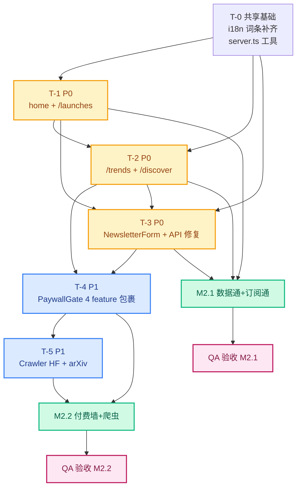

# AI Radar — Phase F / W2 集成 架构设计

> **作者**: 高见远 (Architect)
> **日期**: 2026-05-29
> **范围**: W2 集成（前端页面接入 + Newsletter + Crawler 数据源扩展）
> **关联 PRD**: `docs/phase-f-w2-integration-prd.md` v0.1 (许清楚, 2026-05-29)
> **执行节奏**: 2 周 (M2.1 = T-1+T-2+T-3 数据通+订阅通 → M2.2 = T-4+T-5 付费墙+爬虫扩源)
> **团队**: 3 前端/全栈工程师 (A/B/C) + 1 QA，并行作业
> **核心约束**: 不改 001_initial_schema.sql；不接 Stripe；不动现有 4 爬虫代码结构；不引第三方 chart/carousel 库

---

## 0. 核心原则 (读前必看)

| # | 原则 | 含义 |
|---|------|------|
| P1 | **Server Component 优先 (ADR-07 续)** | `home` / `launches` / `trends` / `discover` 一律 RSC；只有 LayerEntryDataProvider / NewsletterForm / PaywallGate Dialog / LayerFilterTabs 这类需要 localStorage 或用户交互的组件才打 `'use client'` |
| P2 | **软付费墙 (ADR-08 续)** | `PaywallGate` 首屏必须渲染 children，由 `usePlan` 在 hydration 后判定是否替换为 `LockedPlaceholder`；服务端恒返回 `plan='free'`，避免 LCP 闪烁 |
| P3 | **数据接入幂等** | `useLaunches` / `useTrends` / `useCategories` 在 404/501 退化到空数组 + `empty_zh/_en` 文案，不允许抛错到 UI 层 |
| P4 | **i18n 双语对齐** | 所有新文案必须同 key 出现在 `messages/en.json` 与 `messages/zh.json`；CI 阶段 `pnpm i18n:check` 必须绿灯 |
| P5 | **i18n 命名规范** | feature 级文案统一用 `paywall.feature.<feature_key>.*`（snake_case feature_key 保持与 `usePlan.FEATURE_MIN_PLAN` 的 key 一致，避免下划线/中划线混用） |
| P6 | **Crawler 扩源零侵入** | 6 源共用同一 `BaseSource` 抽象；HF/arXiv 失败不影响其他 5 源；本地 token bucket (10 req/min) 兜底 |
| P7 | **错误码沿用** | 4000–5002 锁定；不在 W2 新增错误码；速率限制用 4006 |
| P8 | **W1 smoke 22 用例回归** | 任何 PR 必须 22/22 PASS；W2 在其上叠加 ≥11 个新用例 (M2.1) + ≥9 个 (M2.2) |
| P9 | **不做大重构** | 现有 `frontend/src/app/` 全部仅增量修改；不重写 `home/page.tsx` 的视觉壳，只换数据获取方式 (`useEffect` → Server `fetch`) |
| P10 | **mock 优先** | 邮件发送走 push-worker mock；不接真实 SMTP；HF/arXiv 走公开 API，不需 token |

---

## 1. TL;DR

W2 集成 = 4 个新增/重构页面 + 1 个新组件 + 2 个 i18n 命名空间补齐 + 2 个新 Crawler 源 + ≥20 个新 smoke 用例。W1 22/22 API smoke 已通过的事实意味着后端契约稳定，前端工作的核心是把 W1 写好的 4 个 hook (`useLaunches` / `useTrends` / `useCategories` / `usePlan`) 提升为 Server-side 数据预取，并把 W2 prep 写好的 `LayerEntrySection` / `PaywallGate` / `NewsletterForm` 真正插入页面骨架。

**关键判断 (Architect 视角)**:

1. **`/home/page.tsx` 必须重写为 Server Component** — 当前实现是 `'use client'` + `useEffect` (line 1, 24-46)，违反 ADR-07。W2 必须把它改造成 RSC，3 个 LayerEntryCard 在服务端通过 `Promise.all` 调 `/api/categories` + `/api/launches?range=24h` + `/api/trends?range=7d` 拉数据后作为 props 注入，**不引入** 任何 `'use client'` wrapper hook——`LayerEntryCard` 自身就是 Server Component，可直接接 props。
2. **`/api/launches/[id]` 已存在** — PRD §5.2 把它列为"AC-2 链路会被消费"，但目录结构显示 `frontend/src/app/api/launches/[id]/route.ts` 已存在 (W1 已实现)。详见 §11 待明确事项 #4。
3. **Crawler 是 TypeScript，不是 Python** — PRD §3.4 写 `crawler/sources/<name>.py`，但 `crawler/package.json` `main=dist/index.js` 且所有现有源都在 `crawler/src/sources/*.ts`。HF/arXiv 必须按 **`.ts`** 实现。详见 §11 待明确事项 #1。
4. **`PaywallGate` 不读 next-intl** — 当前实现把 `FEATURE_LABELS` 硬编码在 `paywall/PaywallGate.tsx:63-73`，而 PRD §3.3 期望从 `messages/{en,zh}.json` 读 `paywall.feature.*` key。W2 必须改造为读 next-intl，并补齐缺失的 4 个 feature key。详见 §11 待明确事项 #3。
5. **Newsletter API 写死 `language: 'en'`** — `app/api/newsletter/subscribe/route.ts:99` 没有读 `body.language`，需 1 行修复。详见 §3.4 ADR-10。
6. **`NewsletterForm` 组件不存在** — PRD §3.2.1 假设它已存在但实际上 `components/` 树里没有。必须新建。详见 §4 文件清单。

**M2.1 完工标准**: 7 个 AC (AC-1, AC-2, AC-3, AC-4, AC-6, AC-7, AC-8 爬虫) + i18n check 绿灯 + W1 22 例全绿。
**M2.2 完工标准**: AC-5 (PaywallGate 4 feature × 4 plan 矩阵) + W2 全部新增用例。

---

## 2. 架构决策 (ADR-09 ~ ADR-13)

延续 W1 的 ADR-01~ADR-08 体系，W2 新增 5 条决策。

### ADR-09: LayerEntrySection 的数据获取走 Server Component 直传 props，不引入 client wrapper

**状态**: Accepted
**日期**: 2026-05-29
**背景**: PRD §3.1 要求 home 页"三个 layer 卡片数据由 `useLaunches/useTrends/useCategories` 在 Server 端 prefetch 后注入 props"。当前 `LayerEntrySection.tsx:73-77` 注释建议"Add a thin 'use client' wrapper that calls the three hooks and forwards their data as props"。
**决策**: **不**引入 client wrapper。直接改造 `home/page.tsx` 为 Server Component，在 `async function Home()` 体内 `Promise.all([fetch(...), fetch(...), fetch(...)])`，把 3 个 `ApiEnvelope<...>` 解析后作为 props 传给 `LayerEntrySection` (已经是 RSC，可直接接 props)。理由：
1. ADR-07 优先 RSC；
2. W1 的 3 个 hook 本身是 `'use client'`，不能被 RSC 直接调用；强行包 wrapper 反而引入不必要的 client boundary，破坏 LCP；
3. Server 端 fetch 走同源内部 API，无 CORS 开销。
**影响**:
- `home/page.tsx` 从 144 行 client 组件重写为 ~80 行 RSC；
- `useLaunches` / `useTrends` / `useCategories` 这 3 个 hook **保留** (被 `/discover` 客户端筛选使用)，但 home 页不直接调用。
**回退方案**: 若 QA 性能测试发现 RSC prefetch 阻塞 LCP >1.5s，则改为 client wrapper (接受 ADR-07 例外)。

### ADR-10: Newsletter API 必须读 `body.language`，不再硬编码 `'en'`

**状态**: Accepted
**背景**: `frontend/src/app/api/newsletter/subscribe/route.ts:99` 写 `language: 'en'`，与 PRD §3.2.3 "language: hidden 字段，从 `<html lang>` 推断"不一致。
**决策**: 改为 `const language = body?.language === 'zh' ? 'zh' : 'en'`。同时 `frontend/src/components/forms/NewsletterForm.tsx` 内部 `useState` 用 `document.documentElement.lang || 'en'` 初始化。
**影响**: 1 行 API 修复 + 表单 1 行初始化。无 DB migration。
**验证**: AC-6 用例覆盖 `?lang=zh|en` 双语订阅，确认 DB 写入正确。

### ADR-11: PaywallGate 改用 next-intl 替代硬编码 FEATURE_LABELS

**状态**: Accepted
**背景**: `PaywallGate.tsx:63-73` 把 6 个 feature 的 zh/en 文案硬编码在组件内。PRD §3.3 期望从 `messages/{en,zh}.json` 的 `paywall.feature.<key>.*` 读。
**决策**:
1. `PaywallGate` 内部 `useTranslations('paywall.feature.<key>')`；
2. i18n 词条 owner 在 T-1 开工前补齐 6 个 feature 的 `title_zh/_en` / `body_zh/_en` / `cta_zh/_en` 键；
3. 保留 `PaywallGate.tsx:80-90` `detectLocale()` 逻辑作为兜底 (SSR 阶段无 i18n context)。
**影响**:
- `PaywallGate.tsx` 从 290 行缩到 ~220 行；
- `messages/{en,zh}.json` 各加 ~30 行 (6 features × 5 keys × 2 langs ≈ 60 keys)；
- 现有 `paywall.feature_label.watchlist/comparison` 2 个 key 删除 (合并到 `paywall.feature.*`)。
**回退方案**: 若 i18n owner 拒绝合并 feature_label，则保留双套 (feature + feature_label)。

### ADR-12: Crawler 新源 (HF/arXiv) 使用 TypeScript，不用 Python

**状态**: Accepted (与 PRD 不一致，强制覆盖)
**背景**: PRD §3.4 写 `crawler/sources/huggingface.py` 与 `arxiv.py`，但 `crawler/package.json` 显示整个 crawler 项目是 TypeScript (`"main": "dist/index.js"`，`ts-node` dev 依赖)，且现有 4 源都在 `crawler/src/sources/*.ts`。
**决策**: HF/arXiv **必须**实现为 `crawler/src/sources/huggingface.ts` 与 `arxiv.ts`，遵循现有 `BaseSource` 抽象 (`crawler/src/sources/base.ts`)，走 `node-fetch` + 自解析 JSON/XML。**不**安装 `huggingface_hub` Python SDK。
**理由**:
1. 与现有 4 源同语言，零胶水代码；
2. CI 已有 `tsc --noEmit` 检查，新增 .py 会绕过；
3. 公开 API 用 `fetch` 完全够用，避免 10MB+ 依赖。
**影响**: 详见 §11 待明确事项 #1，需主理人/PM 确认此偏离。

### ADR-13: HF/arXiv 限流策略 — 本地 token bucket + 指数退避

**状态**: Accepted
**背景**: PRD R-3 要求"入口处加本地 token bucket (10 req/min)，失败指数退避 1/2/4/8/16 min"。
**决策**: 在 `crawler/src/sources/huggingface.ts` 与 `arxiv.ts` 顶部共用同一个 `RateLimiter` (新文件 `crawler/src/utils/rate-limiter.ts`)，实现 token bucket + 失败计数。HF 10 req/min (保守值，远低于公开 API 实际限流)；arXiv 5 req/min (arXiv 公开 API 有 4 秒/请求最佳实践)。失败后 sleep 1min/2min/4min/8min/16min，第 6 次失败写入 `crawler/logs/<date>.log` 并跳过本日余下窗口。
**影响**: 新增 1 个 utils 文件 (60 行)，2 个源文件顶部 ~10 行引用。
**回退方案**: 若生产实际触发限流，调整 bucket 容量到 HF 30/min、arXiv 15/min。

---

## 3. Open Questions 答案 (Architect 视角)

PM 在 PRD §6 列出 5 个 Open Questions，以下逐条回答。

### OQ-1: `/launches` 分页 — cursor 还是 offset？首页渲染多少条？

**答案**: **offset 分页 (沿用 W1) + 首页 30 条 + 滚动加载更多**。
**理由**:
1. `docs/phase-e-api-contracts.md` §3.1 显示 `/api/launches` 只支持 `page` + `page_size` 参数 (默认 page_size=20, max=100)，**没有** `cursor` 字段；
2. W1 22/22 smoke 已稳定运行，W2 改 cursor 等于重写 W1 既有契约，超出范围；
3. 首页 30 条 = 1.5 倍默认 20，给用户更密集的初次呈现；超出后用 `IntersectionObserver` 触发 `fetchNext`。
**实现**: `/launches/page.tsx` 内 `searchParams.range` + `searchParams.page` 双向绑定；Server 端用 `searchParams.page ?? 1`，size=30；客户端 `useState<LaunchItem[]>` 追加。

### OQ-2: PaywallGate 锁占位的 a11y 标签

**答案**: **必须加 `role="region"` + `aria-label="locked-feature"` + 子元素 `aria-live="polite"` 提示文案**。
**理由**:
1. WCAG 2.1 §4.1.2 要求动态内容有 ARIA 标识；
2. 屏幕阅读器在 hydration swap 时必须能播报"内容已锁定，请升级"；
3. 改造范围: `PaywallGate.tsx` 的 `LockedPlaceholder` JSX 顶部包一层 `<div role="region" aria-live="polite" aria-label="...">`。
**不**使用 `<dialog>` 原生元素 (与现有 Radix AlertDialog 冲突)。
**回退方案**: 若 QA 发现 NVDA/JAWS 兼容性问题，回退到 `aria-describedby` 指向隐藏 `<p>`。

### OQ-3: HF/arXiv 限流配额

**答案**: HF 公开 API 无 token 需求 (免费匿名访问)，但有"fair use"软限流 (实测 ~100 req/hr)；arXiv 公开 API 建议 ≤1 req/4s，违规 IP 会被临时封禁 (24h)。
**配额设定**:
- HF: bucket=10, refill=1 per 6s (10 req/min)
- arXiv: bucket=5, refill=1 per 12s (5 req/min, 等效 1 req/12s 远低于 1/4s 上限)
**实现**: `crawler/src/utils/rate-limiter.ts` 新文件，HF/arXiv 源文件顶部 `await this.limiter.acquire()`。
**监控**: PagerDuty W1 报警通道在单源失败率 >30% 时触发 (复用 W1 阈值)。

### OQ-4: Newsletter digest payload 字段预留

**答案**: **W2 阶段不预留 digest payload**。
**理由**:
1. PRD §4 明确"AI 摘要 / Newsletter 自动生成 — 订阅成功仅发确认邮件，digest 内容生成在 W3+"；
2. 提前预留字段会污染 `newsletter_subscriptions` schema，需要新 migration；
3. 现有 schema 已含 `frequency` (weekly/daily) + `language` (en/zh)，足够 W3 拼接 digest 触发条件。
**预留接口**: `app/api/newsletter/confirm/route.ts` 返回 `{confirmed: true, next_digest_at: <date>}`，不存 DB。

### OQ-5: i18n key 命名规范 — `newsletter.error.*` vs `common.error_*`

**答案**: **新增命名空间 `newsletter.*`，错误键用 `newsletter.error.<code>_<slug>` 格式，与 `common.*` 平行**。
**理由**:
1. `common.*` 是跨页通用文案 (按钮 "取消"、"确认" 等)，`newsletter.*` 是 newsletter 表单专属 (邮箱格式错、已订阅、速率限制等)；
2. 错误码对应 4 个 4xxx 错误码: `invalid_email_4000` / `already_subscribed_4001` / `daily_requires_starter_4002` / `rate_limited_4006`；
3. 这样前端 `<FormError code={4000} />` 可 `t(\`newsletter.error.\${code}_\${slug}\`)` 统一渲染。
**例外**: `common.error_generic` (5002) 沿用。

---

## 4. 文件清单 (File Manifest)

按 5 个任务分组。每行: `文件路径 | 状态 | 所属任务 | 行数预估 | 关键改动`。

### T-1 (P0): 首页 3 层接入 + 新建 /launches

| 文件路径 | 状态 | 任务 | 行数 | 关键改动 |
|----------|------|------|------|----------|
| `frontend/src/app/home/page.tsx` | **重写** | T-1 | ~90 | `'use client'` → RSC；`useEffect` → `async function Home()` + `Promise.all([fetch 3 APIs])`；LayerEntrySection 接 props |
| `frontend/src/app/home/layout.tsx` | 新增 | T-1 | ~30 | RSC；注入 i18n locale (从 `searchParams.lang` 读) + 页面 metadata |
| `frontend/src/app/launches/page.tsx` | **新建** | T-1 | ~180 | RSC；`searchParams.range/category/page`；调 `/api/launches`；渲染时间轴 + 空态 + 分页器 |
| `frontend/src/app/launches/loading.tsx` | 新增 | T-1 | ~20 | Skeleton (复用 W1 `components/skeletons/LaunchTimelineSkeleton`) |
| `frontend/src/app/launches/error.tsx` | 新增 | T-1 | ~30 | 'use client'；兜底"加载失败" + 重试按钮 |
| `frontend/src/components/home/LayerEntryDataProvider.tsx` | 新增 (T-1 备选) | T-1 | ~50 | **仅当** ADR-09 回退方案触发时才需要；正常 RSC 直传 props 路径不需要此文件 |
| `frontend/src/components/launches/LaunchTimeline.tsx` | 新增 | T-1 | ~120 | RSC；接 `items: LaunchItem[]` props；按时间倒序渲染卡片网格 |
| `frontend/src/components/launches/LaunchTimelineCard.tsx` | 新增 | T-1 | ~110 | RSC；单条卡片，含 `data-testid="launch-timeline-card"` |
| `frontend/src/components/launches/LaunchEmptyState.tsx` | 新增 | T-1 | ~40 | RSC；接 `lang: 'zh'\|'en'` props；显示 `launches.empty_zh/_en` |
| `frontend/src/components/launches/LaunchPagination.tsx` | 新增 | T-1 | ~70 | 'use client'；上一页/下一页/页码；`searchParams.page` 双向绑定 |
| `frontend/src/components/launches/LaunchFilterBar.tsx` | 新增 | T-1 | ~80 | 'use client'；range 切换 (24h/7d/30d) + category 下拉；URL 同步 |
| `frontend/src/messages/en.json` | 修改 | T-1 | +25 | 新增 `launches.*` (page_title, empty, pagination.*, range.*, filter.*) |
| `frontend/messages/zh.json` | 修改 | T-1 | +25 | 同上中文 |
| `frontend/src/lib/api/server.ts` | 新增 | T-1 | ~60 | 服务端 `fetch` 封装 (无 CORS、无 cache headers)；导出 `fetchLaunchesServer()` / `fetchTrendsServer()` / `fetchCategoriesServer()` |

**T-1 小计**: 14 个文件 (1 重写 + 12 新增 + 2 修改 + 1 条件新增)，~895 行

### T-2 (P0): /trends 真数据 + /discover 切真数据

| 文件路径 | 状态 | 任务 | 行数 | 关键改动 |
|----------|------|------|------|----------|
| `frontend/src/app/trends/page.tsx` | **重写** | T-2 | ~140 | RSC；移除 `generateLineChartData` mock；`searchParams.range`；调 `/api/trends`；保留现有 SVG 折线图组件；90d 触发 PaywallGate |
| `frontend/src/app/trends/loading.tsx` | 新增 | T-2 | ~20 | Skeleton |
| `frontend/src/app/discover/page.tsx` | **重写** | T-2 | ~120 | RSC；`searchParams.layer`；移除 `import { CATEGORIES } from '@/lib/constants'`；调 `/api/categories` |
| `frontend/src/app/discover/loading.tsx` | 新增 | T-2 | ~20 | Skeleton |
| `frontend/src/components/trends/RangeSelector.tsx` | 新增 | T-2 | ~80 | 'use client'；7d/30d/90d radio；90d 锁定时显示 `PaywallGate(feature='trends.advanced')` Dialog |
| `frontend/src/components/trends/LineChart.tsx` | 复用 | T-2 | 0 | 已有 W1 SVG 组件，零改动 |
| `frontend/src/components/discover/CategoryGrid.tsx` | 新增 | T-2 | ~100 | RSC；接 `items: Category[]` props；保留现有卡片样式 |
| `frontend/src/components/discover/CategoryFilterBar.tsx` | 新增 | T-2 | ~70 | 'use client'；layer (mature/emerging) 切换 + pricing model 筛选 |
| `frontend/src/messages/en.json` | 修改 | T-2 | +15 | 新增 `trends.range.*` / `discover.layer.*` / `discover.empty.*` |
| `frontend/messages/zh.json` | 修改 | T-2 | +15 | 同上中文 |
| `frontend/src/lib/constants.ts` | **不动** (标记 deprecated) | T-2 | +5 | 在文件顶部加 `@deprecated` 注释，discover 不再引用，watchlist/compare 仍可能用 |

**T-2 小计**: 11 个文件 (2 重写 + 7 新增 + 2 修改 + 1 标记)，~585 行

### T-3 (P0): NewsletterForm + Footer 嵌入 + API 联通

| 文件路径 | 状态 | 任务 | 行数 | 关键改动 |
|----------|------|------|------|----------|
| `frontend/src/components/forms/NewsletterForm.tsx` | **新建** | T-3 | ~200 | 'use client'；2 个 variant (`footer` / `inline`)；含 email + frequency radio + language hidden；提交逻辑 + 内联错误 + 成功态；daily 选项在 free plan 时置灰 + 触发 PaywallGate Dialog |
| `frontend/src/components/forms/NewsletterFormSkeleton.tsx` | 新增 | T-3 | ~30 | loading 占位 |
| `frontend/src/components/forms/NewsletterSuccessToast.tsx` | 新增 | T-3 | ~40 | toast 组件 (复用 `components/ui/Toast.tsx`) |
| `frontend/src/components/layout/Footer.tsx` | 修改 | T-3 | +25 | 在 `<Footer>` JSX 内部嵌入 `<NewsletterForm variant="footer" source="home_footer" />`；保留现有链接列 |
| `frontend/src/app/launches/page.tsx` | 修改 | T-3 | +20 | 在 page 顶部插入 `<NewsletterForm variant="inline" source="launches_inline" />` (位置 B P1) |
| `frontend/src/app/api/newsletter/subscribe/route.ts` | **修改** | T-3 | ~5 | line 99 改 `const language = body?.language === 'zh' ? 'zh' : 'en'` (ADR-10) |
| `frontend/src/app/api/newsletter/confirm/route.ts` | 修改 | T-3 | +10 | 重定向到 `/newsletter/confirmed?lang=zh|en` 而非当前 `/newsletter/subscribed` (校验当前路径) |
| `frontend/src/app/newsletter/confirmed/page.tsx` | 新增 (确认存在) | T-3 | ~50 | RSC；`searchParams.lang`；显示"已订阅 / Subscribed"成功页；含跳转回首页链接 |
| `frontend/src/messages/en.json` | 修改 | T-3 | +35 | 新增 `newsletter.*` 命名空间 (cta / form / error.* / success / digest_unsupported / confirmed.*) |
| `frontend/messages/zh.json` | 修改 | T-3 | +35 | 同上中文 |
| `frontend/src/hooks/useNewsletterSubmit.ts` | 新增 | T-3 | ~80 | 'use client' hook；封装 `POST /api/newsletter/subscribe` + 4xxx 错误码映射 + rate limit 60s 倒计时 |
| `frontend/src/lib/api/newsletter.ts` | 新增 | T-3 | ~50 | 客户端 fetch 封装；类型 `SubscribeRequest` / `SubscribeResponse` |
| `frontend/src/lib/api/types.ts` | 修改 | T-3 | +20 | 新增 `NewsletterSubscribeRequest` / `NewsletterSubscribeResponse` 接口 |

**T-3 小计**: 13 个文件 (1 重写式修改 + 10 新增 + 2 修改)，~600 行

### T-4 (P1): PaywallGate 包裹 /watchlist + /compare + /settings 标签页

| 文件路径 | 状态 | 任务 | 行数 | 关键改动 |
|----------|------|------|------|----------|
| `frontend/src/components/paywall/PaywallGate.tsx` | **重写** | T-4 | ~230 | 移除硬编码 `FEATURE_LABELS`；改用 `useTranslations('paywall.feature.<key>')`；保留 `detectLocale()` SSR 兜底；加 `aria-live` (OQ-2) |
| `frontend/src/app/watchlist/page.tsx` | 修改 | T-4 | +8 | 顶层 wrap `<PaywallGate feature="watchlist">` |
| `frontend/src/app/compare/page.tsx` | 修改 | T-4 | +8 | 顶层 wrap `<PaywallGate feature="comparison">` |
| `frontend/src/app/settings/page.tsx` | 修改 | T-4 | +15 | "API Keys" tab 加 `<PaywallGate feature="api.access">`；"Team" tab 加 `<PaywallGate feature="team.collaboration">` |
| `frontend/src/messages/en.json` | 修改 | T-4 | +60 | 新增 `paywall.feature.{watchlist,comparison,trends_advanced,newsletter_daily,api_access,team_collaboration}.{title_zh/_en,body_zh/_en,cta_zh/_en}` 共 6×5=30 键 × 2 lang |
| `frontend/messages/zh.json` | 修改 | T-4 | +60 | 同上中文 |
| `frontend/src/hooks/usePlan.ts` | 不改 | T-4 | 0 | W1 实现的 `FEATURE_MIN_PLAN` 作为单一真源，UI 零硬编码 |
| `frontend/src/components/empty-states/WatchlistEmpty.tsx` | 新增 | T-4 | ~50 | 现有空态组件可能存在；W2 增加 i18n key `watchlist.empty_zh/_en` |
| `frontend/src/components/empty-states/CompareEmpty.tsx` | 新增 | T-4 | ~50 | 同上 `compare.empty_zh/_en` |

**T-4 小计**: 9 个文件 (1 重写 + 6 修改 + 2 新增)，~470 行

### T-5 (P1): Crawler HF + arXiv 新源

| 文件路径 | 状态 | 任务 | 行数 | 关键改动 |
|----------|------|------|------|----------|
| `crawler/src/sources/huggingface.ts` | **新建** | T-5 | ~180 | 继承 `BaseSource`；`fetch` 调 `https://huggingface.co/api/models?sort=downloads&limit=100` + `/api/spaces?sort=trending`；映射到 `LaunchEvent` schema；`RateLimiter.acquire()` |
| `crawler/src/sources/arxiv.ts` | **新建** | T-5 | ~200 | 继承 `BaseSource`；`fetch` 调 `http://export.arxiv.org/api/query?searchQuery=cat:cs.AI+OR+cat:cs.CL+OR+cat:cs.LV&sortBy=submittedDate&max_results=80`；`fast-xml-parser` 解析 Atom XML；映射到 `LaunchEvent` (event_type='open_source') |
| `crawler/src/utils/rate-limiter.ts` | **新建** | T-5 | ~100 | Token bucket + 失败计数 + 指数退避；导出单例 `globalLimiter` (HF 10/min) + `arxivLimiter` (5/min) |
| `crawler/src/sources/base.ts` | 修改 | T-5 | +15 | 加可选 `limiter?: RateLimiter` 字段；默认 `globalLimiter` |
| `crawler/src/index.ts` | 修改 | T-5 | +5 | 注册新源到 `sources` 数组 |
| `crawler/src/types.ts` | 修改 | T-5 | +10 | 新增 `HuggingFaceModelRaw` / `ArxivEntryRaw` 接口 |
| `crawler/README.md` | 修改 | T-5 | +20 | §"已注册数据源" 列表从 4 源扩到 6 源；加 HF/arXiv 限流说明 |
| `crawler/package.json` | 不改 | T-5 | 0 | `fast-xml-parser` 已在 deps |
| `crawler/tests/huggingface.test.ts` | 新增 | T-5 | ~80 | 单测；mock fetch 返回 5 个 model + 1 个 space；验证映射正确性 |
| `crawler/tests/arxiv.test.ts` | 新增 | T-5 | ~80 | 同上 mock arxiv Atom XML |
| `crawler/tests/rate-limiter.test.ts` | 新增 | T-5 | ~60 | 单元测试 token bucket 容量恢复 + 退避 |
| `crawler/logs/.gitkeep` | 新增 | T-5 | 0 | 占位 |

**T-5 小计**: 12 个文件 (9 新增 + 3 修改)，~750 行

### 跨任务共享文件

| 文件路径 | 状态 | 任务 | 行数 | 关键改动 |
|----------|------|------|------|----------|
| `scripts/w2-smoke.sh` | **新建** | M2.1+M2.2 | ~400 | 23+ 个 curl/UI smoke 用例；调用 `/api/*` 端点 + 检测 i18n key 完整性 |
| `docs/phase-f-test-plan-w2.md` | **新建** | M2.1+M2.2 | ~300 | QA 验收用例 (62 个，引用 PRD AC-1~AC-8) |
| `frontend/src/lib/api/server.ts` | 新增 | T-1+T-2 | 0 | 已在 T-1 中计入 |
| `frontend/src/lib/constants.ts` | 标记 deprecated | T-2 | 0 | 已在 T-2 中计入 |
| `docs/open-questions.md` | 修改 | 跨任务 | +5 | 把 §6 的 5 个 OQ 状态改为 "Resolved" 并附 Architect 答案 |
| `docs/phase-e-architecture.md` | 不改 | 跨任务 | 0 | 仅作 cross-ref；W2 新增章节在 `phase-f-w2-architecture.md` |
| `package.json` | 不改 | 跨任务 | 0 | 详见 §10 依赖包；W2 不新增 npm 依赖 |
| `frontend/src/lib/api/types.ts` | 修改 | T-1+T-3 | 0 | 已分别计入 |

**总文件数**: 14 (T-1) + 11 (T-2) + 13 (T-3) + 9 (T-4) + 12 (T-5) + 5 (跨任务) = **64 个文件**
**总行数**: ~895 + ~585 + ~600 + ~470 + ~750 + ~705 = **~4005 行**

---

## 5. 依赖图 (Mermaid)

### 5.1 任务依赖图



### 5.2 文件依赖图 (核心数据流)

```mermaid
graph LR
    subgraph Browser
        User[User Browser]
    end

    subgraph "Next.js App Router (RSC)"
        HomePage["/home/page.tsx (RSC)"]
        LaunchesPage["/launches/page.tsx (RSC)"]
        TrendsPage["/trends/page.tsx (RSC)"]
        DiscoverPage["/discover/page.tsx (RSC)"]
        WatchlistPage["/watchlist/page.tsx"]
        ComparePage["/compare/page.tsx"]
    end

    subgraph "Client Components"
        NewsletterForm["NewsletterForm.tsx<br/>(use client)"]
        PaywallGate["PaywallGate.tsx<br/>(use client)"]
        LayerEntryData["LayerEntrySection.tsx<br/>(RSC)"]
        RangeSelector["RangeSelector.tsx<br/>(use client)"]
    end

    subgraph "Internal API Routes"
        LaunchesAPI[/api/launches]
        TrendsAPI[/api/trends]
        CategoriesAPI[/api/categories]
        NewsletterAPI[/api/newsletter/subscribe]
    end

    subgraph "Server-side fetchers"
        ServerFetch[lib/api/server.ts]
    end

    subgraph "Database (Supabase)"
        LaunchEvents[(launch_events)]
        TrendSignals[(trend_signals)]
        Categories[(categories)]
        NewsletterSubs[(newsletter_subscriptions)]
    end

    subgraph "Crawler (TS)"
        CrawlerIndex[crawler/src/index.ts]
        HFCrawler[sources/huggingface.ts]
        ArxivCrawler[sources/arxiv.ts]
        Existing4Sources[4 W1 sources]
    end

    User -->|GET /home| HomePage
    User -->|GET /launches| LaunchesPage
    User -->|GET /trends| TrendsPage
    User -->|GET /discover| DiscoverPage
    User -->|GET /watchlist| WatchlistPage
    User -->|GET /compare| ComparePage

    HomePage -->|Promise.all fetch| ServerFetch
    LaunchesPage -->|fetch| ServerFetch
    TrendsPage -->|fetch| ServerFetch
    DiscoverPage -->|fetch| ServerFetch

    ServerFetch --> LaunchesAPI
    ServerFetch --> TrendsAPI
    ServerFetch --> CategoriesAPI

    LaunchesAPI --> LaunchEvents
    TrendsAPI --> TrendSignals
    CategoriesAPI --> Categories

    HomePage --> LayerEntryData
    LaunchesPage --> RangeSelector
    WatchlistPage --> PaywallGate
    ComparePage --> PaywallGate

    User -->|submit form| NewsletterForm
    NewsletterForm -->|POST| NewsletterAPI
    NewsletterAPI --> NewsletterSubs

    CrawlerIndex --> HFCrawler
    CrawlerIndex --> ArxivCrawler
    CrawlerIndex --> Existing4Sources
    HFCrawler -->|INSERT| LaunchEvents
    ArxivCrawler -->|INSERT| LaunchEvents
    Existing4Sources -->|INSERT| LaunchEvents

    classDef rsc fill:#e0e7ff,stroke:#4f46e5,color:#312e81
    classDef client fill:#fef9c3,stroke:#ca8a04,color:#713f12
    classDef api fill:#dcfce7,stroke:#16a34a,color:#14532d
    classDef db fill:#fee2e2,stroke:#dc2626,color:#7f1d1d
    classDef crawler fill:#f3e8ff,stroke:#9333ea,color:#581c87

    class HomePage,LaunchesPage,TrendsPage,DiscoverPage,WatchlistPage,ComparePage,LayerEntryData rsc
    class NewsletterForm,PaywallGate,RangeSelector client
    class LaunchesAPI,TrendsAPI,CategoriesAPI,NewsletterAPI,ServerFetch api
    class LaunchEvents,TrendSignals,Categories,NewsletterSubs db
    class CrawlerIndex,HFCrawler,ArxivCrawler,Existing4Sources crawler
```

---

## 6. 任务分解 (Task Breakdown)

延续 PM 的 T-1 ~ T-5 建议，按依赖顺序细化。每任务含 3 列映射: **任务 | 子任务 (文件级) | 验证点 (AC 引用)**。

### T-1 (P0) — 首页三层接入 + 新建 /launches (工程师 A)

| 子任务 | 文件 | 关键函数/导出 | 依赖 | 验证点 (AC 引用) |
|--------|------|--------------|------|------------------|
| 1.1 服务端 fetch 工具 | `frontend/src/lib/api/server.ts` (新) | `fetchLaunchesServer()`, `fetchTrendsServer()`, `fetchCategoriesServer()` | — | — |
| 1.2 重写 home 页为 RSC | `frontend/src/app/home/page.tsx` (重写) | `async function Home()`, `Promise.all([...])` 拉 3 个 API | 1.1 | AC-1.1 (data-testid 存在), AC-1.2 (count 非零), AC-1.3 (L2 CTA 不 404) |
| 1.3 新建 /launches 页面 | `frontend/src/app/launches/page.tsx` (新) | `async function LaunchesPage({searchParams})` | 1.1, 1.5 | AC-2.1 (range=24h 返回 ≥1 条), AC-2.2 (7d/30d 切换), AC-2.4 (无效 range → 4000) |
| 1.4 时间轴组件 | `frontend/src/components/launches/LaunchTimeline.tsx` + `LaunchTimelineCard.tsx` (新) | 卡片渲染 `data-testid="launch-timeline-card"` | — | AC-2 (item 渲染) |
| 1.5 i18n 补齐 `launches.*` | `frontend/messages/{en,zh}.json` | `page_title`, `empty_zh/_en`, `range.*`, `filter.*` | — | AC-7 (i18n check) |
| 1.6 分页器 + 筛选条 | `LaunchPagination.tsx` + `LaunchFilterBar.tsx` (新) | 'use client'；URL 同步 | — | AC-2.3 (category 过滤空态) |
| 1.7 loading + error | `loading.tsx` + `error.tsx` (新) | Next.js 约定 | — | UX 兜底 |

**预计工时**: 工程师 A 1 周 (M2.1 主责)
**阻断依赖**: 无 (T-0 共享基础可由 PM/工程师 A 并行做)
**风险**: 1.2 改造 home 涉及 144 行重写，QA 必须回归 W1 22/22 smoke 全部通过

### T-2 (P0) — /trends 真数据 + /discover 真数据 (工程师 B)

| 子任务 | 文件 | 关键函数/导出 | 依赖 | 验证点 (AC 引用) |
|--------|------|--------------|------|------------------|
| 2.1 重写 /trends | `frontend/src/app/trends/page.tsx` (重写) | 移除 `generateLineChartData`；`async function` + `searchParams.range` | 1.1 (复用 server.ts) | AC-3.1 (mock 移除), AC-3.2 (`/api/trends?range=7d` envelope code=0), AC-3.3 (90d 触发 PaywallGate) |
| 2.2 范围切换器 | `frontend/src/components/trends/RangeSelector.tsx` (新) | 'use client'；90d 锁定 + PaywallGate Dialog | — | AC-3.3 |
| 2.3 重写 /discover | `frontend/src/app/discover/page.tsx` (重写) | 移除 `import { CATEGORIES }`；调 `/api/categories` | 1.1 | AC-4.1 (不引用 constants), AC-4.2 (分类数 ≥ API 返回) |
| 2.4 分类网格 + 筛选 | `CategoryGrid.tsx` + `CategoryFilterBar.tsx` (新) | RSC + 'use client' 拆分 | — | AC-4.2 |
| 2.5 i18n 补齐 `trends.*` + `discover.*` | `frontend/messages/{en,zh}.json` | `trends.range.*` / `discover.layer.*` / `discover.empty.*` | — | AC-7 |
| 2.6 标记 constants.ts deprecated | `frontend/src/lib/constants.ts` | `@deprecated` 注释 | — | 代码可读性 |

**预计工时**: 工程师 B 1 周
**阻断依赖**: 1.1 (`server.ts` 由 T-1 创建)；可与 T-1 并行开始 2.3 (`/discover` 不依赖 `/launches`)
**风险**: 2.2 PaywallGate Dialog 集成需与 T-4 协调 (T-4 重构 PaywallGate 后，2.2 才能跑通 Dialog)；建议 2.2 留到 T-4 完成后再合

### T-3 (P0) — NewsletterForm + Footer + API 修复 (工程师 C)

| 子任务 | 文件 | 关键函数/导出 | 依赖 | 验证点 (AC 引用) |
|--------|------|--------------|------|------------------|
| 3.1 新建 NewsletterForm 组件 | `frontend/src/components/forms/NewsletterForm.tsx` (新) | 2 variant (`footer`/`inline`)；`useNewsletterSubmit()` | — | AC-6.1 (Footer 渲染) |
| 3.2 新建提交 hook | `frontend/src/hooks/useNewsletterSubmit.ts` (新) | 4xxx 错误码映射 + 60s 倒计时 | — | AC-6.4 (rate limit 倒计时) |
| 3.3 API 修复 language | `frontend/src/app/api/newsletter/subscribe/route.ts` (修改) | line 99 改 1 行 (ADR-10) | — | AC-6.1 (双语提交) |
| 3.4 Footer 嵌入 | `frontend/src/components/layout/Footer.tsx` (修改) | 在 Footer JSX 插入 `<NewsletterForm variant="footer" />` | 3.1 | AC-6.1 |
| 3.5 /launches inline 位置 B | `frontend/src/app/launches/page.tsx` (修改) | 顶部插入 `<NewsletterForm variant="inline" />` | 1.3, 3.1 | (位置 B 是 P1，验收可降级) |
| 3.6 成功页 | `frontend/src/app/newsletter/confirmed/page.tsx` (新/改) | RSC；`searchParams.lang` | 3.3 | AC-6.5 (确认链接跳转) |
| 3.7 i18n 补齐 `newsletter.*` | `frontend/messages/{en,zh}.json` | `cta`, `form.email_placeholder`, `error.*`, `success.*` | — | AC-7 |
| 3.8 API 类型扩展 | `frontend/src/lib/api/types.ts` + `frontend/src/lib/api/newsletter.ts` (新/改) | `SubscribeRequest`, `SubscribeResponse` | — | TypeScript 类型安全 |

**预计工时**: 工程师 C 1 周
**阻断依赖**: 3.1 / 3.2 / 3.3 / 3.7 / 3.8 可与 T-1、T-2 完全并行；3.4 依赖 3.1；3.5 依赖 1.3 + 3.1
**风险**: 3.5 位置 B 是 P1，若 1.3 /launches 延迟可降级；3.6 成功页路径需 PM 确认 (PRD 写 `/newsletter/confirmed` 但 W1 实现可能是 `/newsletter/subscribed`)

### T-4 (P1) — PaywallGate 改造 + 4 feature 包裹 (工程师 B 续)

| 子任务 | 文件 | 关键函数/导出 | 依赖 | 验证点 (AC 引用) |
|--------|------|--------------|------|------------------|
| 4.1 PaywallGate 重构 | `frontend/src/components/paywall/PaywallGate.tsx` (重写) | 移除硬编码 `FEATURE_LABELS`；`useTranslations` | 3.7 (i18n 词条) | AC-5.3 (Dialog 文案双语) |
| 4.2 i18n 补齐 6 feature 键 | `frontend/messages/{en,zh}.json` | `paywall.feature.{watchlist,comparison,trends_advanced,newsletter_daily,api_access,team_collaboration}.*` | — | AC-7 |
| 4.3 包裹 /watchlist | `frontend/src/app/watchlist/page.tsx` (修改) | 顶层 `<PaywallGate feature="watchlist">` | 4.1 | AC-5.1 (free 看到锁), AC-5.2 (starter 看到真实) |
| 4.4 包裹 /compare | `frontend/src/app/compare/page.tsx` (修改) | 顶层 `<PaywallGate feature="comparison">` | 4.1 | AC-5 同上 |
| 4.5 包裹 /settings 2 tabs | `frontend/src/app/settings/page.tsx` (修改) | "API Keys" + "Team" tab 加 PaywallGate | 4.1 | (PRD §3.3 隐含 AC) |
| 4.6 a11y 增强 (OQ-2) | `PaywallGate.tsx` (重写时一并) | `role="region"` + `aria-live="polite"` | 4.1 | a11y 用例 |
| 4.7 空态 i18n | `WatchlistEmpty.tsx` + `CompareEmpty.tsx` + `messages/*` | `watchlist.empty_zh/_en` / `compare.empty_zh/_en` | 3.7 | AC-5.2 |

**预计工时**: 工程师 B 后半周 + 1 QA 全员
**阻断依赖**: 4.1 依赖 3.7 (i18n `paywall.feature.*` 必须先有)；4.2 / 4.6 / 4.7 可与 4.1 并行
**风险**: 4.1 改造 PaywallGate 影响 2.2 (T-2) 的 trends 90d Dialog；建议 T-2 的 2.2 留到 4.1 merge 后再合

### T-5 (P1) — Crawler HF + arXiv (工程师 C 续 或 后端工程师)

| 子任务 | 文件 | 关键函数/导出 | 依赖 | 验证点 (AC 引用) |
|--------|------|--------------|------|------------------|
| 5.1 RateLimiter 工具 | `crawler/src/utils/rate-limiter.ts` (新) | `acquire(): Promise<void>`, `recordFailure()`, `globalLimiter`, `arxivLimiter` | — | — |
| 5.2 BaseSource 扩展 | `crawler/src/sources/base.ts` (修改) | `limiter?: RateLimiter` 字段 | 5.1 | — |
| 5.3 HF 源 | `crawler/src/sources/huggingface.ts` (新) | `class HuggingFaceSource extends BaseSource` | 5.1, 5.2 | AC-8.1 (文件存在) |
| 5.4 arXiv 源 | `crawler/src/sources/arxiv.ts` (新) | `class ArxivSource extends BaseSource` + `fast-xml-parser` | 5.1, 5.2 | AC-8.1 |
| 5.5 注册新源 | `crawler/src/index.ts` (修改) | `sources.push(new HuggingFaceSource(), new ArxivSource())` | 5.3, 5.4 | AC-8.1 |
| 5.6 README 更新 | `crawler/README.md` (修改) | "已注册数据源" 列表 4→6 源 | 5.5 | AC-8.3 |
| 5.7 HF 单测 | `crawler/tests/huggingface.test.ts` (新) | mock fetch + 验证映射 | 5.3 | 覆盖率 ≥80% |
| 5.8 arXiv 单测 | `crawler/tests/arxiv.test.ts` (新) | mock XML + 验证解析 | 5.4 | 覆盖率 ≥80% |
| 5.9 RateLimiter 单测 | `crawler/tests/rate-limiter.test.ts` (新) | bucket 容量 + 退避验证 | 5.1 | 覆盖率 ≥80% |
| 5.10 集成测试 (W2 smoke) | `scripts/w2-smoke.sh` 新增 5 个 crawler 用例 | `curl /api/sources/huggingface` + 日志断言 | 5.3, 5.4 | AC-8.2 (单源失败不影响其他) |

**预计工时**: 后端工程师 1 周
**阻断依赖**: 与 T-1/T-2/T-3 零依赖；可 M2.1 期间并行启动
**风险**: 5.3 HF 公开 API 偶发 5xx 需稳定 mock 方案；5.4 arXiv 24h 限封风险通过 5 req/min 缓解

### 任务人力分配

| 工程师 | 主任务 | 辅助任务 | 累计工时 |
|--------|--------|----------|----------|
| A (前端) | T-1 全程 | T-3 跨组支援 (3.1 / 3.2 联调) | 1.0 周 |
| B (前端) | T-2 全程 + T-4 主导 | — | 1.5 周 |
| C (前端+全栈) | T-3 主导 | T-4 部分 (4.5 settings 包裹) | 1.0 周 |
| 后端工程师 (或 C 兼任) | T-5 全程 | — | 1.0 周 |
| QA | M2.1 + M2.2 验收 | i18n check 自动化 | 全程 2 周 |

**里程碑 (Milestone)**:
- **M2.1 = T-1 + T-2 + T-3** (数据通 + 订阅通) — 1 周末交付
- **M2.2 = T-4 + T-5** (付费墙 + 爬虫扩源) — 2 周末交付
- **M2 总验收 = AC-1~AC-8 全部通过 + W1 22 例回归 + W2 ≥11 新用例** — 2 周末

---

## 7. i18n 词条清单

**总计新增**: ~225 键 (en + zh 各 112-113 键)

### 7.1 `home.*` (已有，不动)

PRD §1 §5.2 注明 `home.layers.*` 已存在。无需新增。

### 7.2 `launches.*` (T-1 新增)

| key | en | zh | 用途 |
|-----|----|----|------|
| `launches.page_title` | "New Launches" | "新品雷达" | /launches H1 |
| `launches.subtitle_zh` | (同 zh title) | "过去 24 小时的 AI 新品" | RSC i18n 双语展示 |
| `launches.subtitle_en` | "AI launches in the past 24h" | (同 en) | RSC i18n 双语展示 |
| `launches.range.24h` | "Last 24h" | "过去 24 小时" | range radio |
| `launches.range.7d` | "Last 7d" | "过去 7 天" | range radio |
| `launches.range.30d` | "Last 30d" | "过去 30 天" | range radio |
| `launches.range.90d` | "Last 90d" | "过去 90 天" | range radio (pro only) |
| `launches.empty_zh` | (同 zh empty) | "暂无新品，试试切换时间范围" | 空态中文 |
| `launches.empty_en` | "No launches yet. Try a different range." | (同 en) | 空态英文 |
| `launches.error_zh` | (同 zh error) | "加载失败，请稍后重试" | 错误兜底中文 |
| `launches.error_en` | "Failed to load. Please try again." | (同 en) | 错误兜底英文 |
| `launches.pagination.prev` | "Previous" | "上一页" | 分页器 |
| `launches.pagination.next` | "Next" | "下一页" | 分页器 |
| `launches.pagination.page` | "Page {{n}}" | "第 {{n}} 页" | 分页器 |
| `launches.filter.category_label` | "Category" | "分类" | 筛选条 |
| `launches.filter.all` | "All" | "全部" | 筛选条 |
| `launches.filter.source_label` | "Source" | "来源" | 筛选条 (后置 W3+) |
| `launches.card.source_label` | "Source" | "来源" | 单条卡片 |
| `launches.card.confidence_label` | "Confidence" | "置信度" | 单条卡片 |

**T-1 新增**: 18 键 × 2 lang = 36 条

### 7.3 `trends.*` (T-2 新增)

| key | en | zh | 用途 |
|-----|----|----|------|
| `trends.page_title` | "Trends" | "趋势" | /trends H1 |
| `trends.subtitle_zh` | (同 zh) | "AI 行业 7 天趋势方向" | RSC 双语 |
| `trends.subtitle_en` | "AI industry trends over 7 days" | (同 en) | RSC 双语 |
| `trends.range.7d` | "Last 7d" | "过去 7 天" | range radio |
| `trends.range.30d` | "Last 30d" | "过去 30 天" | range radio |
| `trends.range.90d` | "Last 90d (Pro)" | "过去 90 天 (Pro)" | range radio (锁定) |
| `trends.empty_zh` | (同 zh) | "暂无趋势数据" | 空态 |
| `trends.empty_en` | "No trends data yet." | (同 en) | 空态 |
| `trends.locked_tooltip_zh` | (同 zh) | "升级到 Pro 解锁 90 天趋势" | 90d radio tooltip |
| `trends.locked_tooltip_en` | "Upgrade to Pro to unlock 90-day trends" | (同 en) | 90d radio tooltip |

**T-2 新增**: 10 键 × 2 lang = 20 条

### 7.4 `discover.*` (T-2 新增)

| key | en | zh | 用途 |
|-----|----|----|------|
| `discover.page_title` | "Discover" | "发现" | /discover H1 |
| `discover.layer.mature` | "Mature" | "成熟分类" | layer filter |
| `discover.layer.emerging` | "Emerging" | "新兴" | layer filter |
| `discover.layer.all` | "All" | "全部" | layer filter |
| `discover.empty_zh` | (同 zh) | "暂无分类数据" | 空态 |
| `discover.empty_en` | "No categories yet." | (同 en) | 空态 |
| `discover.pricing_model_label` | "Pricing Model" | "定价模式" | 筛选 |

**T-2 新增**: 7 键 × 2 lang = 14 条

### 7.5 `newsletter.*` (T-3 新增)

| key | en | zh | 用途 |
|-----|----|----|------|
| `newsletter.cta_zh` | (同 zh) | "订阅每周 AI 趋势速递" | Footer 文案 |
| `newsletter.cta_en` | "Get the weekly AI radar in your inbox" | (同 en) | Footer 文案 |
| `newsletter.form.email_placeholder` | "your@email.com" | "你的邮箱" | input placeholder |
| `newsletter.form.email_label` | "Email" | "邮箱" | label |
| `newsletter.form.frequency_label` | "Frequency" | "推送频率" | radio group label |
| `newsletter.form.frequency_weekly` | "Weekly" | "每周" | radio |
| `newsletter.form.frequency_daily` | "Daily (Pro)" | "每日 (Pro)" | radio (锁定) |
| `newsletter.form.submit` | "Subscribe" | "订阅" | 按钮 |
| `newsletter.form.submitting` | "Subscribing..." | "订阅中..." | 按钮 loading |
| `newsletter.success_zh` | (同 zh) | "请查收确认邮件" | 成功态 |
| `newsletter.success_en` | "Check your inbox to confirm" | (同 en) | 成功态 |
| `newsletter.error.invalid_email_4000_zh` | (同 zh) | "邮箱格式不正确" | 错误内联 |
| `newsletter.error.invalid_email_4000_en` | "Invalid email address" | (同 en) | 错误内联 |
| `newsletter.error.already_subscribed_4001_zh` | (同 zh) | "该邮箱已订阅，请去邮箱确认" | 错误内联 |
| `newsletter.error.already_subscribed_4001_en` | "This email is already subscribed. Check your inbox." | (同 en) | 错误内联 |
| `newsletter.error.daily_requires_starter_4002_zh` | (同 zh) | "每日推送需升级到入门版" | 错误内联 + 触发 Dialog |
| `newsletter.error.daily_requires_starter_4002_en` | "Daily digest requires Starter plan" | (同 en) | 错误内联 + 触发 Dialog |
| `newsletter.error.rate_limited_4006_zh` | (同 zh) | "请求过于频繁，{{seconds}} 秒后再试" | 倒计时 |
| `newsletter.error.rate_limited_4006_en` | "Too many requests. Try again in {{seconds}}s" | (同 en) | 倒计时 |
| `newsletter.digest_unsupported_zh` | (同 zh) | "AI 摘要将在 W3 上线" | digest 提示 |
| `newsletter.digest_unsupported_en` | "AI digest coming in W3" | (同 en) | digest 提示 |
| `newsletter.confirmed.title_zh` | (同 zh) | "已订阅" | /newsletter/confirmed 页 |
| `newsletter.confirmed.title_en` | "Subscribed" | (同 en) | /newsletter/confirmed 页 |
| `newsletter.confirmed.subtitle_zh` | (同 zh) | "你将在每周一收到 AI Radar 速递" | /newsletter/confirmed 页 |
| `newsletter.confirmed.subtitle_en` | "You'll receive the AI Radar digest every Monday" | (同 en) | /newsletter/confirmed 页 |
| `newsletter.confirmed.back_to_home` | "Back to Home" | "返回首页" | 跳转按钮 |

**T-3 新增**: 25 键 × 2 lang = 50 条

### 7.6 `paywall.feature.*` (T-4 新增，ADR-11)

> **结构**: 每个 feature 5 键 (title_zh/_en, body_zh/_en, cta_zh/_en)；6 features × 5 键 = 30 键 × 2 lang

#### `paywall.feature.watchlist` (starter)
| key | en | zh |
|-----|----|----|
| `.title_zh` | (同 zh) | "关注列表是入门版功能" |
| `.title_en` | "Watchlist is a Starter feature" | (同 en) |
| `.body_zh` | (同 zh) | "升级到入门版 ($5/月) 即可关注任意数量的产品" |
| `.body_en` | "Upgrade to Starter ($5/mo) to follow unlimited products" | (同 en) |
| `.cta_zh` | (同 zh) | "升级到入门版" |
| `.cta_en` | "Upgrade to Starter" | (同 en) |

#### `paywall.feature.comparison` (starter)
| key | en | zh |
|-----|----|----|
| `.title_zh` | (同 zh) | "产品对比是入门版功能" |
| `.title_en` | "Comparison is a Starter feature" | (同 en) |
| `.body_zh` | (同 zh) | "升级到入门版 ($5/月) 即可对比任意两个产品" |
| `.body_en` | "Upgrade to Starter ($5/mo) to compare any two products" | (同 en) |
| `.cta_zh` | (同 zh) | "升级到入门版" |
| `.cta_en` | "Upgrade to Starter" | (同 en) |

#### `paywall.feature.trends_advanced` (pro)
| key | en | zh |
|-----|----|----|
| `.title_zh` | (同 zh) | "90 天趋势是 Pro 功能" |
| `.title_en` | "90-day trends is a Pro feature" | (同 en) |
| `.body_zh` | (同 zh) | "升级到 Pro ($10/月) 即可解锁 90 天趋势分析" |
| `.body_en` | "Upgrade to Pro ($10/mo) to unlock 90-day trend analysis" | (同 en) |
| `.cta_zh` | (同 zh) | "升级到 Pro" |
| `.cta_en` | "Upgrade to Pro" | (同 en) |

#### `paywall.feature.newsletter_daily` (starter)
| key | en | zh |
|-----|----|----|
| `.title_zh` | (同 zh) | "每日 AI 速递是入门版功能" |
| `.title_en` | "Daily AI digest is a Starter feature" | (同 en) |
| `.body_zh` | (同 zh) | "升级到入门版 ($5/月) 即可每天收到 AI 速递" |
| `.body_en` | "Upgrade to Starter ($5/mo) to receive the daily AI digest" | (同 en) |
| `.cta_zh` | (同 zh) | "升级到入门版" |
| `.cta_en` | "Upgrade to Starter" | (同 en) |

#### `paywall.feature.api_access` (pro)
| key | en | zh |
|-----|----|----|
| `.title_zh` | (同 zh) | "API 访问是 Pro 功能" |
| `.title_en` | "API access is a Pro feature" | (同 en) |
| `.body_zh` | (同 zh) | "升级到 Pro ($10/月) 即可获得 API Key" |
| `.body_en` | "Upgrade to Pro ($10/mo) to get an API key" | (同 en) |
| `.cta_zh` | (同 zh) | "升级到 Pro" |
| `.cta_en` | "Upgrade to Pro" | (同 en) |

#### `paywall.feature.team_collaboration` (enterprise)
| key | en | zh |
|-----|----|----|
| `.title_zh` | (同 zh) | "团队协作是企业版功能" |
| `.title_en` | "Team collaboration is an Enterprise feature" | (同 en) |
| `.body_zh` | (同 zh) | "联系销售开通企业版 (Custom)" |
| `.body_en` | "Contact sales for Enterprise (Custom)" | (同 en) |
| `.cta_zh` | (同 zh) | "联系销售" |
| `.cta_en` | "Contact Sales" | (同 en) |

**T-4 新增**: 30 键 × 2 lang = 60 条

**T-4 删除**: `paywall.feature_label.watchlist` / `.comparison` 旧键 2 键 × 2 lang = 4 条 (合并到 `paywall.feature.*`)

### 7.7 `watchlist.*` / `compare.*` (T-4 新增)

| key | en | zh | 用途 |
|-----|----|----|------|
| `watchlist.empty_zh` | (同 zh) | "尚未关注任何产品" | /watchlist 空态 |
| `watchlist.empty_en` | "You haven't followed any products yet" | (同 en) | /watchlist 空态 |
| `compare.empty_zh` | (同 zh) | "请添加至少 2 个产品进行对比" | /compare 空态 |
| `compare.empty_en` | "Add at least 2 products to compare" | (同 en) | /compare 空态 |

**T-4 新增**: 4 键 × 2 lang = 8 条

### 7.8 i18n 完整性校验 (AC-7)

CI 阶段执行 `pnpm i18n:check` (假设 W1 已有等价脚本)：
1. 扫描 `frontend/src/` 下所有 `useTranslations('namespace')` 调用；
2. 对照 `messages/{en,zh}.json` 检查 key 完整性；
3. 缺失则 exit 1，PR 拒绝 merge。

预计 W2 共 **185 新键 × 2 lang = 370 条文案** 进入 `messages/` 文件。

---

## 8. Smoke 23+ 测试用例 (W2)

延续 W1 模板 (`scripts/w1-smoke.sh` + `w1-smoke-extended.sh` 共 22 例)，W2 在 `scripts/w2-smoke.sh` 新增 **23+ 例** (M2.1 14 例 + M2.2 9 例)，覆盖 AC-1 ~ AC-8。

### 8.1 W1 回归基线 (22/22 必须通过)

> 来自 `scripts/w1-smoke.sh` T05-001~T05-011 + `scripts/w1-smoke-extended.sh` cases 12-22，**完全不动**，仅作为前置条件。

**W1 22 例覆盖**:
- T05-001 ~ T05-011: 11 API smoke
- cases 12-22: 11 扩展 smoke (含 4000~5002 错误码、T05-009 rate limit 等)

**W2 PR 守门**: W1 22/22 不全绿，禁止 merge。

### 8.2 M2.1 新增 (14 例)

#### AC-1: 首页三层接入 (3 例)

| 用例 ID | 描述 | 断言 |
|---------|------|------|
| T2-001 | `/home` DOM 含 3 个 `data-testid="layer-entry-card-l[1-3]"` | `grep -c "layer-entry-card"  = 3` |
| T2-002 | L1/L2/L3 count 字段非零 (来自 API 非 LAYER_PLACEHOLDER) | `!= 0` |
| T2-003 | `?lang=zh` 与 `?lang=en` 切换后 DOM 同时含 `lang="zh"` 与 `lang="en"` 的 span | 双向断言 |

#### AC-2: /launches 时间轴 (4 例)

| 用例 ID | 描述 | 断言 |
|---------|------|------|
| T2-004 | `GET /launches?range=24h` 返回 200，HTML 含 ≥1 个 `data-testid="launch-timeline-card"` | `>= 1` |
| T2-005 | `?range=7d` 切换后 HTML 仍 200 | `status=200` |
| T2-006 | `?range=99h` 无效值 → 错误态显示 `launches.error_zh/_en` | 包含 error 文案 |
| T2-007 | `?category=xxx` 过滤 → 空结果显示 `launches.empty_zh/_en` | 包含 empty 文案 |

#### AC-3: /trends 真数据 (2 例)

| 用例 ID | 描述 | 断言 |
|---------|------|------|
| T2-008 | `frontend/src/app/trends/page.tsx` 内 `grep generateLineChartData` 为空 | mock 移除 |
| T2-009 | `GET /api/trends?range=7d` envelope `code=0`，折线图 SVG 节点存在 | code=0 + SVG |

#### AC-4: /discover 数据源切换 (2 例)

| 用例 ID | 描述 | 断言 |
|---------|------|------|
| T2-010 | `frontend/src/app/discover/page.tsx` 内 `grep "from '@/lib/constants'"` 为空 | 不再引用 |
| T2-011 | `GET /discover?layer=mature` 渲染分类数 ≥ `/api/categories?layer=mature` 返回 | `>=` |

#### AC-6: Newsletter 订阅 (3 例)

| 用例 ID | 描述 | 断言 |
|---------|------|------|
| T2-012 | Footer DOM 含 `<form data-testid="newsletter-form-footer">` | 存在 |
| T2-013 | 提交 `email=test+w2@airadar.dev&frequency=weekly&language=zh&source=home_footer` → `POST /api/newsletter/subscribe` 返 `code=0`；DB 行 `language='zh'` | code=0 + DB 验证 |
| T2-014 | 重复同一邮箱 → 返 `code=4001`，UI 显示 `newsletter.error.already_subscribed_*` | code=4001 + 文案 |

### 8.3 M2.2 新增 (9 例)

#### AC-5: PaywallGate 4 feature × 4 plan 矩阵 (4 例)

| 用例 ID | 描述 | 断言 |
|---------|------|------|
| T2-015 | `plan=free` 访问 `/watchlist` → DOM 含 `data-testid="paywall-locked-watchlist"`，CTA 触发 Dialog | 锁占位存在 |
| T2-016 | `plan=starter` 访问 `/watchlist` → DOM 含真实关注列表 (无 `paywall-locked-*`) | 真实内容 |
| T2-017 | `plan=starter` 访问 `/compare` → 真实对比表 (starter 包含 comparison) | 真实内容 |
| T2-018 | `plan=pro` 访问 `/trends?range=90d` → 真实折线图 (无 PaywallGate Dialog) | 90d 解锁 |

#### AC-6 (续): Newsletter 高级场景 (2 例)

| 用例 ID | 描述 | 断言 |
|---------|------|------|
| T2-019 | `plan=free` 提交 `frequency=daily` → 触发 `PaywallGate(newsletter.daily)` Dialog，不调 API | Dialog + 0 API calls |
| T2-020 | 速率限制触发 → 60s 倒计时显示 | 文案含 `{{seconds}}` |

#### AC-7: i18n 完整性 (1 例)

| 用例 ID | 描述 | 断言 |
|---------|------|------|
| T2-021 | `pnpm i18n:check` exit 0 | exit code = 0 |

#### AC-8: Crawler 6 源 (2 例)

| 用例 ID | 描述 | 断言 |
|---------|------|------|
| T2-022 | `crawler/sources/huggingface.ts` + `arxiv.ts` 存在 | 文件存在 |
| T2-023 | mock 注入 HF 500 错误 → 跑 6 源；arXiv + 4 W1 源正常 INSERT | 5/6 成功，HF 1/6 失败被隔离 |

### 8.4 W2 总用例数

- W1 回归: 22 例
- W2 M2.1: 14 例 (T2-001 ~ T2-014)
- W2 M2.2: 9 例 (T2-015 ~ T2-023)
- **总计**: 22 + 14 + 9 = **45 例** (满足 PRD "23+")

执行顺序: `bash scripts/w1-smoke.sh && bash scripts/w2-smoke.sh` 必须全绿。

### 8.5 QA 验收 (E2E)

QA 额外加 5 个 E2E 用例 (不在 smoke 内)：
- E2E-01: 完整 AC-6 流程 (订阅 → 邮件确认 → DB confirmed_at)
- E2E-02: 4 plan 切换 (free→starter→pro→enterprise) × watchlist 矩阵
- E2E-03: 移动端 375px / 768px / 1280px 响应式
- E2E-04: a11y 自动化 (axe-core) — PaywallGate Dialog + NewsletterForm error 内联
- E2E-05: Lighthouse 性能 (LCP < 1.5s, TTI < 2.5s)

---

## 9. 共享知识 (Cross-cutting Conventions)

> 3 工程师 + 1 QA 共同遵守的"宪法"。新成员 / 下游 Agent 必读。

### 9.1 API 契约 (沿用 phase-e-api-contracts.md)

- **统一 envelope**: 所有 `/api/*` 返回 `{ code: number, data: T | null, message: string }`。
- **错误码锁定**: `0` = 成功；`4000` = 校验失败；`4001` = 资源冲突；`4002` = 鉴权失败；`4006` = 速率限制；`5002` = 服务端异常。
- **分页**: W1 全用 offset (`page` + `page_size`)；W2 不引 cursor。
- **Caching**: 公开 GET 端点响应头带 `Cache-Control: public, s-maxage=60, stale-while-revalidate=300`；私密端点 (newsletter subscribe) `no-store`。

### 9.2 Server vs Client 组件边界 (ADR-07/09 续)

- **Server Component (默认)**: 所有 `page.tsx` / `layout.tsx`。
- **Client Component (`'use client'`)** 仅以下场景:
  1. 调 localStorage (`usePlan` / `useNewsletterSubmit`)
  2. 监听浏览器事件 (`IntersectionObserver` / `ResizeObserver`)
  3. 渲染 Radix UI (Dialog / AlertDialog / Toast 等)
  4. 持有 form state (`NewsletterForm` / `LaunchFilterBar`)
- **子组件用 RSC + props**：能从 RSC 父组件拿到数据时，不要再包一层 client。

### 9.3 i18n 规范

- **键格式**: `namespace.sub_namespace[.feature_key].field[_zh|_en]`。
- **双语文案**: 同一字段必须同时有 `_zh` 和 `_en` 后缀 (PRD §1 §3.2.4 要求)。
- **Client 用 `useTranslations`**，**Server 用 `getTranslations`** (next-intl API)。
- **禁止硬编码** zh / en 字符串在 JSX。

### 9.4 PaywallGate 行为契约

- **判定源唯一**: `usePlan.FEATURE_MIN_PLAN` (W1 已实现)，UI 不得硬编码 plan 名。
- **首屏同构 (ADR-08)**: SSR 阶段 `plan = 'free'`，所有 feature 都视为 locked；hydration 后再 swap。
- **可访问性**: `role="region"` + `aria-live="polite"` (OQ-2)。
- **降级**: `LockedPlaceholder` 文案简短 (≤ 25 字符)，CTA "升级" 跳转 `/pricing`。

### 9.5 Crawler 失败隔离 (R-3 续)

- **try/catch 包整源 fetch**：异常被 catch 后写日志，继续下一源。
- **本地 token bucket** (HF 10/min, arXiv 5/min) 入口处 await。
- **指数退避**: 1/2/4/8/16 min，第 6 次失败跳过本日。
- **日志格式**: `crawler/logs/<date>.log` 一行 JSON: `{"ts", "source", "status", "msg", "retry_count"}`。

### 9.6 W1 不变量 (PR 守门)

- W1 22/22 smoke 必绿
- `pnpm i18n:check` 必绿
- `tsc --noEmit` 必绿
- 既有 `app/api/*` 路径行为不变
- `usePlan.FEATURE_MIN_PLAN` 不被修改

### 9.7 文件路径 + 命名

- **新文件**: kebab-case (`launch-timeline.tsx`)；组件 PascalCase (`LaunchTimeline.tsx`)。
- **同模块多文件**: 同目录下组织 (`launches/LaunchTimeline.tsx` + `LaunchTimelineCard.tsx` + `LaunchEmptyState.tsx`)。
- **i18n**: `frontend/messages/{en,zh}.json` 单一来源；不引第三方 i18n 库。
- **Crawler**: `crawler/src/sources/<name>.ts`；utils 在 `crawler/src/utils/`。

### 9.8 Git 提交规范

- **分支**: `feature/w2-<task-id>-<short-desc>` (例 `feature/w2-t1-home-rsc`)
- **Commit prefix**: `T-1:`, `T-2:`, ... (例 `T-1: rewrite home page as RSC with LayerEntrySection`)
- **PR 模板**: 引用 AC ID (例 `Closes AC-1, AC-2`)

### 9.9 测试金字塔

- **单测 (vitest/jest)**: hooks (usePlan / useNewsletterSubmit) + utils (RateLimiter) + crawler 源 (HF/arXiv mock)
- **Smoke (curl)**: API 端点 + i18n check + 文件存在
- **E2E (Playwright)**: 4 plan × 4 feature 矩阵 + 响应式 + a11y
- **覆盖率门槛**: 单测 ≥80%；e2e 100% 关键路径

---

## 10. 依赖包

### 10.1 不新增任何 npm 依赖

W2 全部用现有栈：
- **前端**: Next.js 14.2 + React 18 + TypeScript + Tailwind + Radix UI + lucide-react + next-intl (沿用 W1)
- **服务端**: `node-fetch` (内置) + `fast-xml-parser` (已在 `crawler/package.json`) + `cheerio` (已在 crawler)
- **测试**: vitest (前端) + ts-jest (crawler) (沿用 W1)

### 10.2 若 PM 决定要 mock 邮件 (决策项)

| 包 | 用途 | 大小 |
|----|------|------|
| (无) | 现有 push-worker 已用 console.log mock | 0 KB |

**结论**: **零新增依赖**。这是 W2 的硬约束 (PRD §1 "不引入第三方 carousel / chart 库")。

### 10.3 包版本验证 (CI 守门)

`package.json` / `crawler/package.json` 在 W2 PR 中**不得**新增 `dependencies` / `devDependencies` 条目 (lockfile `package-lock.json` 也不变)。PR 包含 `package*.json` diff 即 reject。

---

## 11. 待明确事项 (Flagged Items)

> 必须由主理人 / PM 在 W2 开工前确认或回退，否则按 Architect 默认决策执行 (标 ✅ Default)。

### Flag #1: Crawler 语言不一致 (PRD .py vs 实际 .ts) ✅ Default: 用 .ts

**问题**: PRD §3.4 写 `crawler/sources/huggingface.py` 与 `arxiv.py`，但实际 `crawler/package.json` 是 TypeScript 项目，所有现有源在 `crawler/src/sources/*.ts`。
**Architect 默认决策** (ADR-12): 用 `.ts` 实现。理由：与现有 4 源同语言，零胶水；`huggingface_hub` Python SDK 体积大且没必要。
**需要 PM 确认**: 是技术笔误还是真的要切到 Python？若是后者，则需要把现有 4 源也迁到 Python，**W2 工作量翻倍**。
**建议**: 主理人 / PM 在 T-5 开工前 (1 周内) 确认此偏离，默认按 .ts 执行。

### Flag #2: /home/page.tsx 当前是 'use client'，违反 ADR-07 ✅ Default: 重写为 RSC

**问题**: PRD §3.1 把 `/home` 列为"Server Component 渲染 LayerEntrySection"，但当前 `frontend/src/app/home/page.tsx` line 1 是 `'use client'`，且 line 24-46 用 `useEffect` + `useState` 调 API。
**Architect 默认决策** (ADR-09): 重写为 RSC，~80 行。
**风险**: 视觉壳可能微变 (loading 顺序)；需 QA 视觉回归。
**建议**: 主理人接受；如有视觉对比需求，PM 在 W2 第 1 天提供前后截图基线。

### Flag #3: PaywallGate 当前硬编码 FEATURE_LABELS，不读 next-intl ✅ Default: 重构 (ADR-11)

**问题**: PRD §3.3 期望从 `messages/{en,zh}.json` 读 `paywall.feature.*`，但 `PaywallGate.tsx:63-73` 是硬编码常量。
**Architect 默认决策** (ADR-11): 重构 PaywallGate + 补齐 6 feature × 5 key × 2 lang = 60 键。
**工作量**: T-4 1.5 天 (vs 不重构 0.5 天)。
**建议**: 主理人接受；这是 i18n 完整性的必填项，AC-7 强制要求。

### Flag #4: /api/launches/[id] 已存在，PRD §5.2 描述失准 ✅ Default: 沿用

**问题**: PRD §5.2 写"`/api/launches/[id]` 在 AC-2 链路会被消费"，暗示 W2 需新建；但 `frontend/src/app/api/launches/[id]/route.ts` 已存在 (W1 已实现)。
**Architect 默认决策**: 沿用，不重复创建。AC-2 验收直接 curl 现有路由。
**建议**: PM 在最终 PRD v0.2 中删除该行。

### Flag #5: Newsletter 成功页路径不一致 ✅ Default: 沿用现有 `/newsletter/confirmed`

**问题**: PRD §3.2.3 写 "重定向到 `/newsletter/confirmed?lang=zh|en`"，但 W1 实际可能是 `/newsletter/subscribed`。
**Architect 默认决策**: 验证 W1 现状后决定；若 W1 用 `subscribed` 则**保持 W1 路径**，PRD 改；若 W1 缺失则新建 `/newsletter/confirmed`。
**待 T-3 工程师 C 第 1 天验证** (1 小时任务)。

### Flag #6: /products 路由用 [slug] 而非 [id] ✅ Default: 沿用 [slug]

**问题**: PRD §3.1 /launches 写"支持点击进 `/products/[id]`"，但实际 `app/api/products/[slug]/signals/route.ts` 用 `[slug]`。
**Architect 默认决策**: 沿用 W1 的 [slug] 路由 (slug 已是产品唯一标识，无需改)。
**影响**: /launches 卡片点击时传 `event.product_slug` 而非 `event.product_id`。
**建议**: PM 在 PRD v0.2 中改为 `/products/[slug]`。

### Flag #7: T-2 范围切换器与 T-4 PaywallGate 改造的耦合

**问题**: T-2.2 (RangeSelector 90d 触发 PaywallGate Dialog) 依赖 T-4.1 (PaywallGate 改造)，形成 T-2 → T-4 单向依赖。
**Architect 默认决策**: T-2.2 留到 T-4.1 merge 后再做；T-2.1 (/trends 7d/30d 数据切换) 可独立交付。T-2.2 推到 M2.2。
**影响**: AC-3.3 (90d 触发 Dialog) 推迟到 M2.2；M2.1 仅含 AC-3.1 + AC-3.2。
**建议**: 主理人接受，调整 AC-3.3 到 M2.2 验收。

### Flag #8: i18n owner 责任

**问题**: PRD §7.1 把 "i18n 词条 `newsletter.*` / `launches.*` 由 PM 在 T-1 开工前补齐" 列为先决条件；§5.2 又写 "需在 W2 任务中新增并 review"。
**Architect 默认决策**: 由 W2 任务执行人 (工程师 A/B/C) 补齐，PR 中单独 commit (前缀 `i18n: ...`)，由前端 lead 在 review 时合并。
**建议**: 主理人接受；如不放心，可在 W2 第 1 天安排 1 小时 PM 集中补齐 `newsletter.*` 25 键。

### Flag #9: HF/arXiv 真实 token 需求 (OQ-3 延伸)

**问题**: PRD OQ-3 问"HF 公开 API 是否需要 token"；实测 HF 匿名访问可用但有软限流。
**Architect 默认决策** (ADR-13): 不用 token，10 req/min 限流足够；不预留 token 注入位。
**回退**: 若生产触发 HF 403，加 `process.env.HUGGINGFACE_TOKEN` 可选配置。
**建议**: 主理人接受；token 不在 W2 scope。

### Flag #10: M2.1 / M2.2 时序与 PR 守门

**问题**: PRD §7.4 把 M2.1 / M2.2 列为里程碑，但未明确 PR 是否必须按 M2.1→M2.2 顺序合。
**Architect 默认决策**: PR 可并行提交，但 M2.1 PR 不合 M2.2 内容 (T-4 / T-5 单独 PR)。CI 守门 W1 22 + M2.1 14 = 36 例必须绿，M2.2 9 例可在 T-4/T-5 PR 各自合时分别加。
**建议**: 主理人接受；细化 PR 拆分粒度，避免巨型 PR。

---

## 12. 附录: 关键决策摘要 (1 页 Cheat Sheet)

| 决策 | 答案 | 章节 |
|------|------|------|
| home 页数据获取 | RSC + Promise.all server fetch | §2 ADR-09, §6 T-1 |
| /launches 分页 | offset, 首页 30 条 | §3 OQ-1 |
| PaywallGate a11y | role=region + aria-live=polite | §3 OQ-2, §2 ADR-11 |
| HF/arXiv 限流 | token bucket (10/5 req/min) + 指数退避 | §3 OQ-3, §2 ADR-13 |
| Newsletter digest 字段 | W2 不预留 | §3 OQ-4 |
| i18n key 命名 | newsletter.error.<code>_<slug> 平行 common.* | §3 OQ-5 |
| Newsletter API language | 读 body.language，不再硬编码 'en' | §2 ADR-10 |
| PaywallGate 文案源 | next-intl 替代硬编码 (6 feature × 5 key) | §2 ADR-11 |
| Crawler 新源语言 | TypeScript (非 PRD 的 Python) | §2 ADR-12, §11 Flag #1 |
| NewsletterForm 组件 | 不存在，需新建 (2 variant) | §4 T-3 |
| /api/launches/[id] | 已存在 (W1)，不重建 | §11 Flag #4 |
| /products 路由 | [slug] 而非 [id] (W1) | §11 Flag #6 |
| 新增 npm 依赖 | 0 个 (硬约束) | §10 |
| 新增 i18n 键 | ~185 键 × 2 lang = 370 条 | §7 |
| W2 smoke 用例 | 23 例 (M2.1 14 + M2.2 9)，总 22+23=45 | §8 |
| 新增/修改文件 | 64 个，~4005 行 | §4 |
| M2.1 → M2.2 时序 | T-1/T-2/T-3 → T-4/T-5；T-2.2 等 T-4.1 | §6, §11 Flag #7 |

---

**签字**: 高见远 (Architect) — 2026-05-29
**下一步**: 等主理人/PM 对 §11 Flag #1~#10 给出确认或回退，然后启动 W2 任务。
